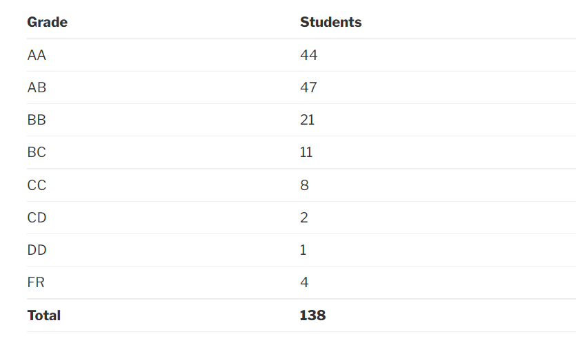

### EE 204 – ANALOG CIRCUITS

**Professor –**

Jayanta Mukherjee

**Motivation –**

The motivation behind this course is to give the students a basic understanding of the analog circuits and analog signals (which is how the the physical conditions are ‘measured’). By the end of this course, the student should be able to design and understand various analog circuits, mostly using OP-AMPs as the basic design entity; and to understand the various aspects that need to be taken care of while designing circuits – like feedback, stability, etc. through bode plots and also through direct observation.

**Prerequisites –**

No hard prerequisites here but some knowledge of EE 207 and EE 112 comes in handy.

**Course content and structure –**

The course begins at a low pace, explaining all the basic concepts of OP-AMPs and builds onto the concepts to slightly more advanced applications. If you had paid sufficient attention in EE112, then this section should be a breeze.

Then the course introduces us to Feedback and Stability criteria which has its applications in various fields because of being a key aspect of control theory. The topic describes  feedback applications, topologies and solving circuits with feedback along with various stability criteria like Nyquist Plot and Barkhausen Criteria. Plotting and analysing of bode plots is an important topic here.

Using the concepts of feedback and stability, an important topic that is covered is about the various types and examples of oscillators and shifters which are very useful in circuit designing.

**Feedback on Lectures and Assignments:**

The lectures often seemed very monotonous and a good number of students attended it mostly because of the attendance policy (80%). Assignments were uploaded regularly and quite a good number of tutorials were conducted on a regular basis to solve the important questions in the assignments which was very helpful in the preparation. The assignments weren’t required to be submitted for checking, but solving them can be considered indispensable for the examinations.

The professor also uploaded his hand-written notes on Moodle (there were no slides) but they more or less carried the same content that he taught in class so attending the classes and tutorials and paying attention would be enough to do well in this course.

**Difficulty –**

Easy

**Mode of evaluation and marks distribution –**

There were 2 quizzes (10% + 10%), one midsem (30%) and one endsem (50%).

The first quiz consisted of some tricky questions that forced us to think about the solution properly instead of just applying the same method we had been doing in the classes. Rest of the papers were moderately easy.

**Grading –**

Grading was pretty lenient in our year. Here are the statistics:

**Textbook References –**

- Millman and A. Grabel, Microelectronics, McGraw Hill
- Microelectronic Circuits by Sedra and Smith, 6th Edition

**Reviewed by –**

Anmol Gupta (iitb.anmol@gmail.com)