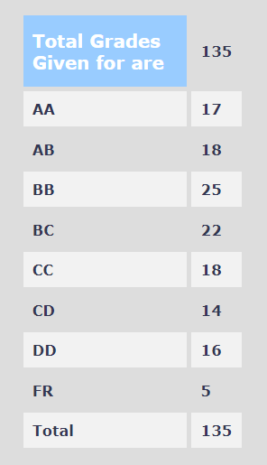

### EE 204 – ANALOG CIRCUITS

**General Description :**

The EE204 course for Analog Circuits comes right along as EE UGs (finally) begin getting a taste of core electrical courses, after three semesters of almost all generic courses learnt. Many students end up loving this course and the course on Digital Circuits, and these fields begin to be sought after for internships in the future. It is important, therefore, to take a deep dive into what this course offers and if it matches up to the students’ expectations.

**Instructor :** 

Prof. Jayanta Mukherjee

**Prerequisites :** 

Students may find the knowledge of EE112 useful.

**Course content and structure :**

This year, the course was taken up in two separate divisions, with Prof. Jayanta Mukherjee for the BTech students and Prof. Dipankar Saha for the DD students. I belong to the former division and can mainly vouch for the experience I had in this division.

The course will surely cover Operational Amplifiers, Frequency Response, Feedback, Filters, and non-linear devices like diodes, oscillators and MOSFETs. The BTech division learnt the curriculum in the order mentioned above, but the DD students did not. This is important, because the EE230 lab course, which should ideally go hand-in-hand with this theory course, is also expected to roughly follow the above order. Also different between the two divisions was the depth to which each of the topics were taught and the time devoted to each of the topics. The DD students, for example, learnt MOSFETs in a lot more detail (for more than half a semester), while the BTech students had them wrapped up in a couple of lectures. Needless to say, BTech students learnt more about other topics, and I am at a loss to guess which teaching method will ultimately prove to be the best.

**Lectures and assignments :**

The lecture content was very well organized, and students always had a fair idea of the motivation behind what they were studying. Prof Mukherjee did upload his hand-written notes to Moodle later, but they aren’t useful if you haven’t attended the lectures. I recommend always studying from your own notes.

Two out of the three weekly lectures were theory lectures, and one was a dedicated tutorial slots. There were upwards of 12 tutorial sheets in the entire semester, the problems in which went in close association with the running theory classes. The TAs were helpful and a great resource to get your doubts cleared. All the questions were solved in the class itself, and there was never any homework to be turned in or graded.

**Difficulty :**

The course was easier than your average course, but the difficulty level had increased from the previous year, despite having been taught by the same professor.

**Marks distribution :**

50% for the endsem, 30% for the midsem and 10% for each of the two quizzes.

**Grading Statistics :**

**Textbooks :**

Microelectronic Circuits by Sedra and Smith, 6th Edition