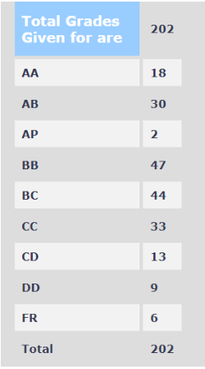

### EE 204 – ANALOG CIRCUITS

**Course Offered In:**

Autumn 2021

**Instructor(s):**

Prof. Rajesh Zele

**Prerequisites:**

None

**Difficulty:**

3/5

**Course Content:**

- Opamp as a black box, its non-idealities and circuits
- PN junction and circuits
- BJT model and circuits
- MOS – operation and model, MOS circuits
- CMOS technology
- Single-stage amplifiers
- Cascode – Bipolar and MOS
- Current mirrors
- Differential Amplifier
- Frequency response, Feedback
- Stability analysis, Oscillators, Analog Filters

**Feedback on Lectures:**

The lectures were well planned, and the slides provided by Sir were pretty comprehensive.
Ours was a covid batch; therefore, lectures were made available on youtube, and weekly doubt clearing sessions were conducted by Sir. In an offline scenario, I strongly recommend attending lectures as Sir teaches enthusiastically and practical aspects are sometimes demonstrated too.

**Feedback on Evaluations:**

The evaluation consisted of –
- Weekly quizzes(42%) – were fast-paced, and speed along with accuracy played a crucial role for scoring in these. Regularity is the key to attain decent marks in them
- Midsem(25%) and Endsem(33%) – Both consisted of two parts comprising of an objective and a subjective paper. Objective paper tested analytical skills, and in subjective paper sometimes theory right off the slides were asked.

Overall, the exams were of mediocre difficulty level, and a good understanding of the material is required to achieve a good grade. Sometimes incentives such as bonus marks were provided for attending lectures. Weekly tutorials were also conducted to discuss the quiz

**Grading Statistics:**

**Study Material and References:**

- A.S.Sedra and K.C. Smith, Microelectronic Circuits
- Behzad Razavi, Microelectronics, Second Edition, Wiley

**Follow-up Courses:**

A plethora of options open up when you complete this course which you can take based upon your interests in the field of VLSI Design, Devices etc.

**Final Takeaways:**

This course is meant to be an intro to analog design and serves as a foundation for many of the courses you take in the future. Make sure to devote sufficient time building up your understanding as everything is taught from scratch. More detail about the course can be found on the Prof’s homepage – EE204_Content

**Review by:**
 
Raavi Gupta, 2024 (BTech.)