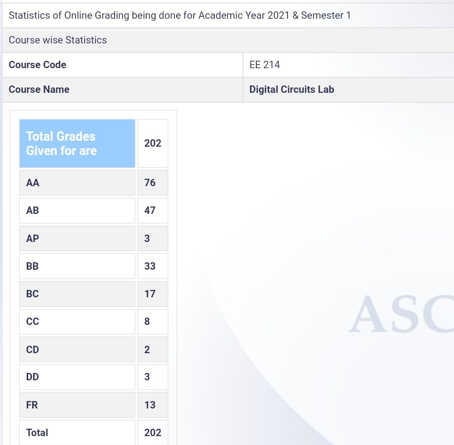

**Review by**

Bhagyashree Singh, BTech (2024)

**Course Offered In**

Autumn 2021

**Instructors**

Prof. Maryam Shojaei Baghini

**Prerequisites**

EE224, which runs parallel to this lab course

**Difficulty**

Moderately Easy (2 out of 5 with 5 being the hardest)

**Course Content**

1. Familiarization with Quartus + Modelsim software for design / implementation /simulation
2. Get familiar with the Krypton CPLD board.
3. Use the Krypton board to design and implement combinational circuits.
4. Verify using switches and LED’s on the Krypton board.
5. Get familiar with the scan-based tester equipment and methodology.
6. Use the Krypton board to design and implement more complex combinational circuits.
7. Verify using a scan-based tester.
8. Use the Krypton board to design and implement simple finite state machines and test them using the scan-based tester.
 
**Feedback on Lectures**

The lab was conducted entirely in online mode. 

Each lab session began with a short moodle quiz. Quiz topics were provided in advance, and the quiz consisted of both theory questions and questions involving calculations. The TAs were quite helpful; thus, everyone could complete the labs within the 3-hour timeframe. We also had to submit a lab report weekly, consisting of our simulation results. Overall, the workload was low and easily manageable.

**Feedback on Evaluations**

The midsem and endsem were both 3-hour exams which involved handwritten submission + VHDL design submission. Once the hand-written part was ready, the VHDL part was relatively straightforward. The exam questions were practical-based but manageable if you’d done the labs sincerely. There were also short quizzes before each lab based on the Pre-lab reading topics.

The evaluation for this course was as follows:
Online lab performance + Report + Homework : 50 % 
Quizzes (best 5 out of 7): 20 % 
Midsem: 15 %
Endsem: 15 % 

**Study Material and References**

There are no textbooks as such. The labs were based on the quizzes whose topics were provided beforehand. Following EE224 slides and some googling was more than enough.

**Follow-up Courses**
 

**Final Takeaways**

Overall, the course was well structured and interesting.

**Grading Statistics:**

The grading was very generous. The grading stats of our year are as follows:

