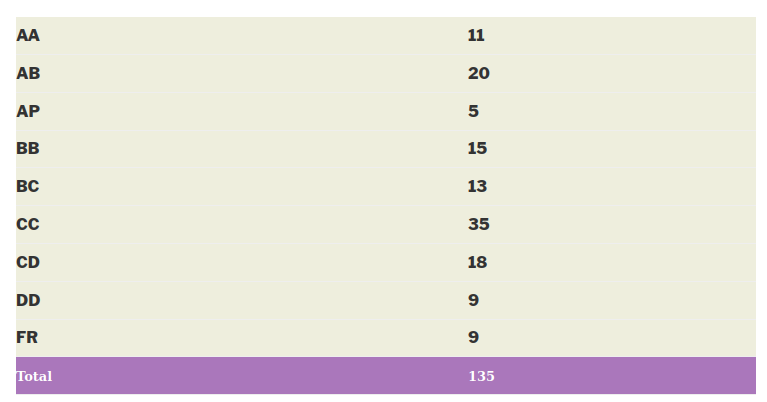

---
layout: page
title: Course Reviews
subtitle:
cover-img: assets/img/Cover_study.jpg
thumbnail-img: ""
share-img: ""
comments: true
tags: [Academic]
---

### EE 223 - Data Analysis and Interpretation

**Course offered in:**
Autumn 2014

**Instructors:**

Prof. D. Manjunath

**Motivation behind the course:**
A basic and foundational course followed in all departments to give introduction to probability theory and statistics (previously ran under the name IC 102).

**Course Content:**
First nine chapters of Probability and Statistics for Engineers and Scientists by Sheldon M. Ross (Fourth Edition).
**Prerequisites:**
There are no hard pre-requisites for this course.
**Feedback on Lectures:**
The professor believed in extensive revision of previous lecture and stressed on intuitive understanding behind definitions. The lectures were conducted taking the aid of lecture slides (not posted anywhere later). However all slides and examples were derived from the textbook (by Sheldon Ross).

**Feedback on Tutorials, Assignments and Exams:**

In class tutorials included a set of 10-12 problems (followed by brief explanation of the questions by prof.) at the end of each chapter.
5 Surprise quizzes – total 20% + Midsem (30%) + Endsem(50%)

**Difficulty:**
6 on a scale of 10
**Grading Statistics:**

Review by – Dheeraj kotagiri <kdhiru1994@gmail.com>