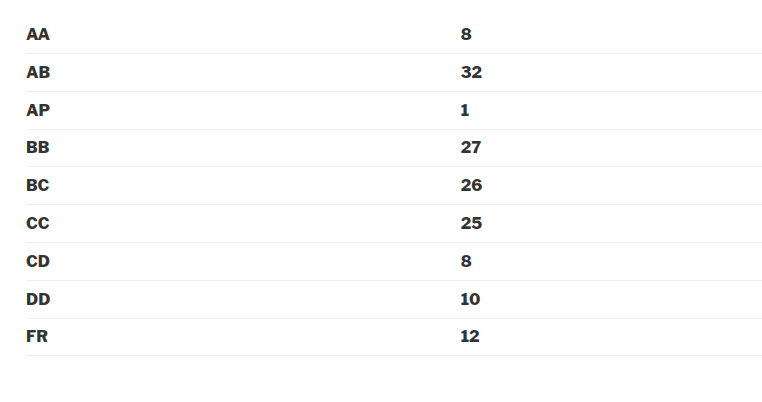

---
layout: page
title: Course Reviews
subtitle:
cover-img: assets/img/Cover_study.jpg
thumbnail-img: ""
share-img: ""
comments: true
tags: [Academic]
---

### EE 223 - Data Analysis and Interpretation

**Course offered in:**

Autumn 2017

**Instructors:**

Prof. Prasanna Chaporkar

**Motivation behind the course:**
The course is a core course in the third semester of the undergraduate electrical program, and is notorious for its absolute grading. The course is an introduction to Probability and Statistics. It begins with normal introduction to the measures of estimation, random variables and follows to rather complex topics like unbiased estimators and hypothesis testing. The course is crucial for various applications in signal processing and communication. This course is a prerequisite for the course EE325(Probability and Random processes).

**Course Content:**

The topics covered in my semester were- Data representation, Elements of Probability, Random Variables and Expectations, Parameter estimation and Hypothesis Testing.
The course basically covered the first 8 chapters of Probability and Statistics for Engineers and Scientists by Sheldon M. Ross (Fourth Edition).

**Prerequisites:**
This is a basic course and is taught from scratch. But, it serves as a pre-requisite to EE325, so it is advised to keep the notes from this course as they will be useful later.
**Feedback on Lectures:**
The lectures are extremely important, for there are no slides for you to go through them at leisure. Taking notes is strongly recommended. The professor is really exuberant about teaching, and will repeat any concept ten times if he has to. Some things are hard to follow but the professor gives more time to those topics accordingly. You have to be attentive and consistent most of the time, because most of the things are interconnected. DO NOT miss classes or you will lose track of what is going on. The initial topics are easy as they are somewhat known to most people. The topics covered in the latter half are the real mind-benders. You will be provided assignments, and even solutions, but do go to the tutorials for the professor discusses some critical concepts in them(sometimes).
**Feedback on Tutorials, Assignments and Exams:**

There are a total of six schedules quizzes, with the professor considering best 5 out of 6. The professor is willing to take as many quizzes as possible, provided he’s given enough enthusiasm and the students are willing to give time to the quizzes. Each quiz is of 20 marks, making a total of 100 when 5 of them are considered. The initial quizzes are compartively easier, but overall, the quizzes are tough. A lot of them were open-notebook when we took them. We were able to take 7 quizzes with the last 2 quizzes happening during the end-sem consecutively. The tutorials do help. But most of the question are very logical and have very straightforward, step-by-step approach. With your basics clear, the quizzes can be quite smooth.

**Difficulty:**
Difficult. The quizzes can be tough or easy depending on how consistent you are. Course is pretty hectic compared to other courses, because of the consecutive quizzes taken every two to three weeks.

**Grading Statistics:**

The grading is absolute, usually with 90+ getting AA, 80+ getting AB and so on.

**References**
The notes are sufficient for the course. Two books were recommended by the professor, and he even gave reading assignments.
* An introduction to Probability and Statistics – Vijay Rohatgi
* Introduction to Probability and Statistics for Engineers and Scientists – Sheldon M. Ross