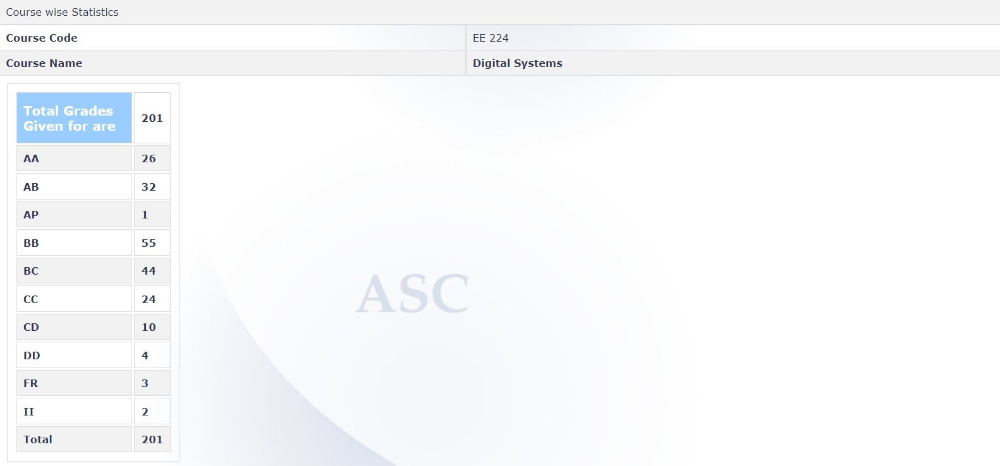

# EE 224 – DIGITAL SYSTEMS (2021)

**Course Offered In:** Autumn 2021

**Instructor(s):** Prof Siddharth Tallur

**Prerequisites:** None

**Difficulty:**

The course was not difficult in terms of content being taught, but the exams were totally unexpected and very difficult. Devoting weekly about 3hrs(lectures)+3-4 hrs(self study and assignments) would suffice to earn a good grade. Grading was more lenient than expected (26 AA, 32 AB out of 200 students)

**Course Content:**

This course covers the basics of digital systems, and builds upon what you would have learned in the EE113 digital subpart. For us though, the pace was very slow until midsem, and not much was covered till then(mostly basics of binary representation of numbers, boolean expressions, KMaps etc). But after the midsem, prof started giving us video lectures from a previous offering of the same course by Prof. Virendra Singh, which were definitely interesting, but it was difficult for us to catch up to the pace that we had lost before midsems.

**Feedback on Lectures:**

In the initial half of the course, lectures were taken live by professor, and he was firm against his decision on giving pre-recorded lectures. But due to factors like low attendance and slow pace, he gave pre-recorded lectures by Prof Virendra post midsem. There were regular doubt sessions held every week.

**Feedback on Evaluations:**

The evaluations were done on the basis of Midsem(30%), Endsem(40%) and an Assignment(30%). The exams were open book.

The assignment was unique, as we had to come up with our own questions(2), and find their answers. We were graded on the efforts that we put in-like well structured and complete questions, language clarity, correctness of solutions etc (you can have a look at the Bloom’s Taxonomy that prof decided to grade our questions on). The exams were largely(70-80%)  
puzzle solving and the rest was actual technical stuff taught in the course. Puzzles were in general tough, and did require some high level thinking. I remember one puzzle being straight out of the movie X+Y.

**Grading Statistics:**

**Study Material and References:**

Digital Design, John F. Wakerly, Pearson.

**Follow-up Courses:**

EE309 – Microprocessors, EE214 – Digital Circuits Lab

**Final Takeaways:**

The course was good, and the content was well structured and easy to grasp. This review is based on my experience, and may differ drastically if another professor offers the same course. All the Best !

**Review by – Shivam Patel, 2024(BTech)**
