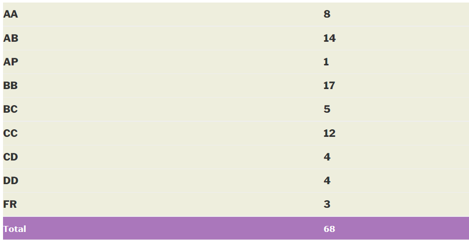

---
layout: page
title: Course Reviews
subtitle: EE 227 – Microelectronics (2014)
cover-img: assets/img/Cover_study.jpg
thumbnail-img: ""
share-img: ""
comments: true
tags: [Academic, Core]
---
# EE 227 – MICROELECTRONICS

**Academic Year** – 2014-15

**Semester**  – Autumn

**Professor**  –  Prof.Bipin  Rajendran ( Course in-charge )

**About the course**  – This course is mandatory for all 2nd year Dual Degree Microelectronics students and can be taken as an elective by others . As a course EE 227 is very different from any other you will probably take up in the future or have taken up in the past . For starters this course is not conducted by a single professor rather by close to 10 different professors who take 1-2 lectures each . As the course name suggests most of these professors are a part of the micro – electronics department within EE but profs from other specializations also take a couple of lectures . The main aim of this course is to give students a flavour of the various avenues within the umbrella of micro-electronics itself . Each prof simply gives students a small insight into their field of interest and does not go into the details

This course was run for the first time during this academic year and hence there were periods when students felt they were simply drifting from topic to topic without really imbibing much , but the course organization and structure should be better defined in years to come .

**Motivation**

-   Develop intuition and appreciation for the true mandate of microelectronics i.e – the process of converting atoms to useful systems

-   Understand how to write component specifications based on system description

-   Understand how novel device design and fabrication happens at the interface of solid state/quantum physics, materials science, and chemistry

-   Create process flows for integrating devices/circuits

-   Identify trade-offs involved in microelectronic device design

-   Design small circuits for specific applications

-   Read and critique microelectronic papers that appear in top journals and conferences

**Pre – Requisites** : Either EE 101 or EE 112 must have been done prior to taking this course

**Course content and topics covered –**

-   Basic Transistor physics
-   Advanced Transistors
-   Process Integration
-   Computer and memory systems and their architecture
-   NVM architecture
-   Digital System design
-   Communication Systems
-   Optical devices
-   MEMS devices
-   Energy harvesting

**Evaluation** – Literature Review – 10%

Midsem – 42%

Endsem – 48 %

_Literature Review_ : Thrice during the early part of the semester the students were given a research paper relevant to the course content and were asked to either write a critique or draw their conclusions on certain points . For example, we were given a presentation on Intel’s fabrication process and asked to give an opinion on how it matched up to TSMC’s with respect to certain criteria . Naturally the professor didn’t expect any path breaking insights and was quite happy if the student put in an honest effort .

_Midsem_ : The midsem was based completely on a research paper which was loosely based on topics covered in class up to that point . The exam was an open book , open notes exam with students free to bring in whatever material they liked including the paper itself . The questions were mostly easy and scoring was high .

_Endsem_  : Unlike the midsem , the endsem was a closed book exam . It was divided into several sections each pertaining to a topic taught by a particular professor . Since the professor’s themselves didn’t delve into much detail , the endsem featured just basic questions about each topic

**Grading** –

**Study material and references** – Since this course was taken by so many professors there was no real study material to follow . Some professors relied entirely on the blackboard while others put up the slides they used in class .

**Advanced courses** – This course is a stand alone course in itself but can help the student decide which stream they would like to take future courses in .

Reviewed by **Rishabh Iyer <rishabh246@gmail.com>**
