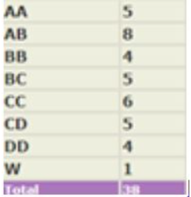

---
layout: page
title: Course Reviews
subtitle: EE 227 – Microelectronics (2017)
cover-img: assets/img/Cover_study.jpg
thumbnail-img: ""
share-img: ""
comments: true
tags: [Academic, Core]
---
# EE 227 – MICROELECTRONICS

**Academic Year** – 2017-18

**Semester** – Autumn

**Professor** – Dipankar Saha

**About the course** – This course is mandatory for all 2nd year Dual Degree Microelectronics students and can be taken as an elective by others. This course covered a lot of different topics as an introduction but did not delve deeper into each topic. The professor was inclined towards teaching whatever the students were interested in and hence the course content could go according to majority consensus. The instructor covered all the topics in a lucid manner and even though attendance wasn’t mandatory, a large percentage showed up for the lectures.

**Pre – Requisites** : Either EE 101 or EE 112 and PH107 must have been done prior to taking this course

**Course content and topics covered –**

-   Basic Boolean algebra
-   Analog and Digital Converters
-   Basic Transistor physics
-   Advanced Transistors
-   Basics of LEDs and LASERs
-   Quantum wells, dots and their simulation

**Evaluation** – Quizzes – 20%

Midsem – 30%

Endsem – 50 %

_Midsem_ : The midsem was based completely on the content covered until basic device physics of transistors. It was a moderately difficult paper like the quizzes.

_Endsem_ : Unlike the midsem , the endsem was a open notes exam . It was divided two sections. 40% for theory and 10% simulation. It was a moderately difficult paper where having the open notes wasn’t much help.

**Grading –**

**Study material and references** – Since this course covered many topics, there was no particular book to follow as such. Microelectronics by Jacob Millman was quite useful for some of the topics covered. Slides were put up for topics that were difficult.

**Advanced courses** – This course is a stand alone course in itself but can help the student decide which stream they would like to take future courses in .
