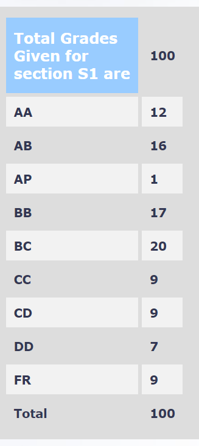

**Review by**

Durgaprasad Prakash Bhat, 2024(BTech.)

**Course Offered In**

Autumn 2021

**Instructors**

Prof. Animesh Kumar

**Prerequisites**

None. Core course for Elec B.Tech and DD

**Difficulty**

Moderate

**Course Content**

Properties of continuous and discrete time signals, convolutions(discrete and continuous time), Fourier Transforms, properties of fourier transforms, Basic filters like low pass, high pass, band pass, their representations in time and frequency domains, bandlimited signals and their properties, Fourier series and its properties, Shannon sampling theorem, aliasing effect and ways to mitigate it, Discrete fourier transform, circular convolution, fast fourier transform.
 
**Feedback on Lectures**

The lectures were moderately paced. The topics were explained very well. Most concepts were mathematical in nature with application in signals and systems. The mathematical construct of concepts were explaind first, followed by a example related to signals and systems. The practice problems provided were sometimes difficult but extremely beneficial in understanding as well as practicing the concepts and for quizzes. The prof made digital notes during the lecture which were provided to students

**Feedback on Evaluations**

The prof conducted 7-8 short quizzes throughout the semester. The quiz duration was 40-50 min. These were often long and mathematical given the time duration. The questions were directly based  on the practice problems provided, hence going through them was very important.

**Study Material and References**

1. Oppenheim A V , Schafer R W - Discrete-Time Signal Processing 
2. Martin Vetterli, Jelena Kovacevic, Vivek K Goyal - Foundations of Signal Processing 

**Follow-up Courses**

EE 679 (Speech processing)
EE 603 (Digital signal processing and it's application)

**Final Takeaways**

A very good introduction to basic concepts of signals and systems. 

**Grading Statistics:**

