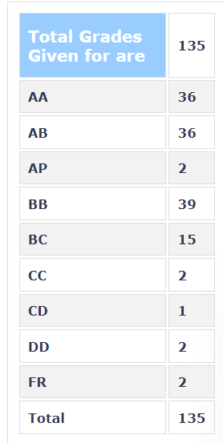

### EE 236 - Electronic Devices Lab

**Course offered in:**

Autumn 2018

**Professors:**

 Siddharth Tallur, Narsingha Rao

**Prerequisites:** 

NA

**Motivation:**

The course is expected to go hand-in-hand with the theory course of semiconductor devices (EE207), but at the same time provide a much wider practical exposure

**Course content and structure:**

There were around 10 experiments, to be performed in a pair. The students were expected to do some pre-lab work, in-lab work, and use the data obtained to draw conclusions and submit a post-lab report. The experiments revolved around noting the IV characteristics of several devices, including diodes, transistors, LEDs and more. It is always a delight to observe working models of what one has studied in the theory courses, and also to observe the deviations of those devices from ideality.

Learning about the emulation software NGSpice will be an important aspect of this course. The prelab work was usually to simulate the experiment in advance and note what to expect when the experiment is performed practically. The exams will contain a small portion devoted to spice simulations, too.

All the professors, WEL faculty members and appointed RAs are very approachable and helpful.

Before every experiment, one of the professors would explain the theory behind that experiment, and the RAs would be all set to solve any doubts you may have. They will ensure your learning objectives achieve fruition.

**Difficulty:**

 Chill

**Evaluation:**

All the experiments carried some amount of weightage. The marks for the experiments were calculated based on pre-lab work, in-lab work and post-lab work. The midsem and endsem did consist of simulations and practical experiments both. There was no course project included in the curriculum.

**Grading:**

The grading was really lenient this time around – too lenient, as some might say. That’s never a bad thing though!

