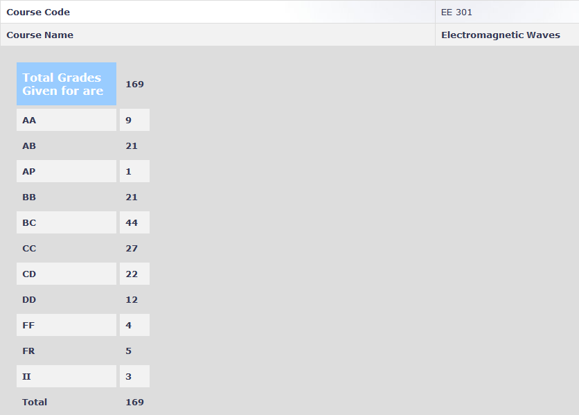

**Review by**

Shreyas Sabnis, 2024 (DD)

**Course Offered In**

Autumn 2021

**Instructors**

Prof. R.K. Shevgaonkar, Prof. Kasturi Saha

**Prerequisites**

No prerequisites, the instructor teaches everything from scratch. Concepts from PH108 and MA105 are useful.

**Difficulty**

4/5 (on a scale of 1-5 with 5 being very tough)

**Course Content**

1. Basics of transmission lines: Transformation of load impedance, reflection, VSWR, Smith chart to solve problems and impedance matching
2. Maxwell’s equations, EM waves: Propagation of electromagnetic waves in different media; reflection and refraction at media interfaces; types of polarization; parallel plane and rectangular waveguides
3. Introduction to Antennas: Hertz Dipole, radiation fields and intensity, directivity

**Feedback on Lectures**

Lectures primarily involve the derivation of key results from basic laws and previously derived results with a focus on the physics of the results rather than the math. Almost every lecture introduces some new concept and the lectures are highly interdependent, so attending every lecture attentively is crucial. Tutorials were conducted in one of the slots every alternate week. Solving tutorial problems and understanding solutions are of utmost importance.

**Feedback on Evaluations**

1. Two Quizzes (10% each): Objective questions involving direct application of derived results and formulae
2. Term Paper (15%): Choose and thoroughly understand a recent paper related to EM waves and give a comprehensive review; a strict plagiarism check was done 
3. Midsem (25%): Moderately difficult conceptual questions
4. Endsem (50%): Some questions require a deep understanding of the concepts as well as lengthy calculations; most of the questions need the application of multiple concepts to arrive at the answer

The checking was quite strict and the TAs expected clear answers with proper steps.

**Study Material and References**

Electromagnetic Waves by R.K. Shevgaonkar: Highly recommended to go through the solved examples of the relevant chapters, especially the ones after Maxwell’s equations.
 
**Follow-up Courses**

1. EE606: Fibre Optic Communication
2. EE609: Radiating Systems

**Grading Statistics:**

