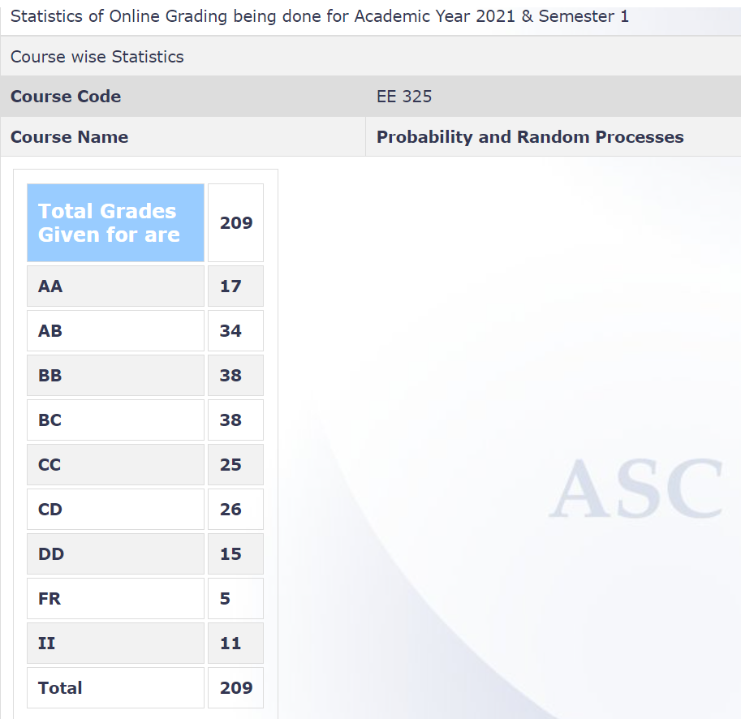

**Review by**

Siddhant Midha, 2024 (BTech.)

**Course Offered In**

Autumn 2021

**Instructors**

Prof D. Manjunath and Prof B.K. Dey

**Prerequisites**

Having a good grasp on basic linear algebraic and calculus concepts is helpful. (First year MA courses)

**Difficulty**

3/5

**Course Content**

This is a foundational course on probability. Roughly, the content is arranged as follows,
1. Set theory and combinatorial probabilistic problems.
2. Notions of conditional probability, independence, conditional independence etc.
3. Axioms of the probability measure, definition of probability space, Borel Cantelli Lemma.
4. Random variables, probability distributions, functions & transformations of random variables. 
5. Expectation, variance, covariance, properties and theorems.
6. Multiple random variables, random vectors, multi-variate distributions.
7. Moment and probability generating functions, characteristics functions.
8. Tail and concentration bounds, law of large numbers, central limit theorem.
9. Random Processes - examples, continuity and differentiation of random processes.
10. LTI Systems and white gaussian noise.

The content gets more and more involved as the course progresses, it is good to keep up-to-date with the lectures.
 
**Feedback on Lectures**

The lecture delivery was as follows,
1. Pre-recorded lectures: 2-3 Hours per week.
2. Live interactions: 1 or 2 hours per week.

The pre-recorded lectures were concise and to the point. Could be perceived as a bit dry sometimes, so some effort on one’s part (perhaps taking notes or just paying attention) was required. The live interactions were pretty nice, the instructor discussed doubts, and time permitting went into interesting aspects of probability theory. One recalls an interaction full of discussion upon random graphs.

**Feedback on Evaluations**

The evaluations were fairly simple. While the course content became increasingly heavy as the course progressed, there was never a need to memorise formulae or keep a lot of advanced theory in mind because the questions always tested basic fundamentals. 

The distribution was as follows,
1. Weekly moodle quizzes - 5%
2. Group Assignments - 15%
3. Midsem - 30%
4. Endsem - 50%

The weekly quizzes were very easy, just a recap. The group assignments had interesting simulation and theory problems. Not tough. The midsemester and endsemester examinations were fairly simple and tested fundamentals.
Weekly tutorials were held, tutorial problems were often interesting, and tougher than the those asked in the examinations.

**Study Material and References**

The instructor mentioned reference books for different topics in the lecture notes. On that (pun) note, the lecture notes were also concise and well written. The following books were mentioned,

1. A. Papoulis and S. Unnikrishnan Pillai, “Probability, Random Variables and Stochastic Processes," Fourth Edition, McGraw Hill. [Good for the beginning of the course]
2. Bruce Hajek, “Probability with Engineering Applications: ECE 313 Course Notes”. [Very nice explanations for the post midsem parts]
3. G. Grimmett and D. R. Stirzaker, “Probability and Random Processes." Third Edition, Oxford University Press. [Referred in topics in between]
4. S. Ross, “A first course in probability,” 8th Edition, Prentice Hall, 2010.

**Follow-up Courses**

This course opens the door to a host of interesting courses in communication systems, queueing theory, adaptive signal processing, information theory, control theory and machine learning along with statistical inference.

**Final Takeaways**

Having a good understanding of the concepts discussed in this course is crucial for pursuing further study in a lot of fields as mentioned above. 

**Grading Statistics:**

