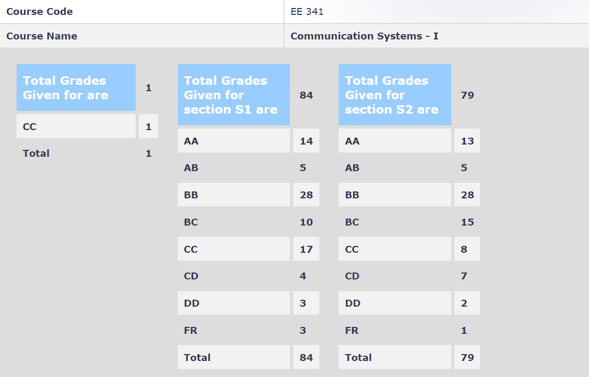

**Review by**

Adit Akarsh 2019-23 BTech

**Course Offered In**

Autumn 2021-22

**Instructors**

Prof Shabbir Merchant and Prof Gaurav Kasbekar

**Prerequisites**

EE229, EE325

**Difficulty**

3/5

**Course Content**

Review of EE229 and EE325: Fourier transform random processes
Lowpass representation of bandpass signals and systems: downconversion and upconversion, lowpass representation of bandpass systems
Analog modulation techniques: Amplitude modulation, DSB, SSB, VSB modulations, Angle modulation: FM and PM
Sampling, quantization and pulse modulation: Sampling and pulse amplitude modulation, PCM and DPCM, Delta modulation, scalar and vector quantization
Overview of multiplexing and multiple access techniques: TDM(A), CDMA, FDM and OFDM(A)
Digital modulation techniques: Basics of PSK, ASK, FSK, QAM; ML demodulator implementation with matched filter, decision regions and probability of error analysis.
Digital communication over bandlimited channels: Intersymbol interference, Nyquist criterion for ISI-free pulse, raised cosine pulse, ML sequence detection for bandlimited channels.

**Feedback on Lectures**

The course ran in an online mode with recorded lectures. The videos provided by Prof Shabbir Merchant were from previously recorded CDEEP lectures. These lectures were very good with hand-drawn and handwritten explanations in the video by the professor. The lectures videos by Prof Kasbekar were a bit dry and difficult to understand in comparison and were mostly a repetition of the written content of slides shown in the video.

**Feedback on Evaluations**

Best ⅔ quizzes for 20%
Midsem for 30%
Endsem for 50%
All of them were subjective and required some thinking and application. Solving the provided practice problem sets (including questions from the reference books) helped a lot in the exams.

**Study Material and References**

Communcation Systems, 5th edition- Simon Haykin
Digital Communcation Systems- Simon Haykin

**Follow-up Courses**

EE706, EE740

**Final Takeaways**

Try to solve all the practice questions provided after watching/attending the lecture

**Grading Statistics:**

