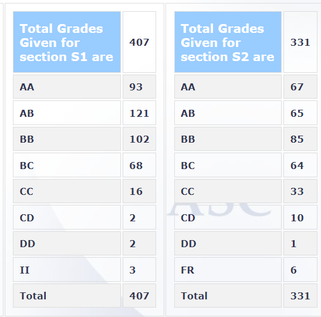

**Your Name and Batch**
Novashree Samantaray (Btech 2019)

**Course Offered In**
Spring 2022

**Instructors**
- Prof Harish C Phuleria (Air Quality)
- Prof Swatantra P Singh (Water Quality)
- Prof Srinidhi Balasubramanian (Solid Waste)

**Prerequisites**
None

**Difficulty**
Easy

**Course Content**
Air Quality - This module was the most informative and hectic compared to the other two. It covered the types and sources of air pollutants, air quality regulations put in place, and the impact of air pollution on human life and climate. It also explores the methods to quantify pollutants’ concentrations, air quality modelling methods and air pollution control methods. Lastly, it focuses on the physics of dispersion of pollutants in the atmosphere (the most interesting part of all, and expect a lot of questions from this section).

Water Quality - The initial lectures cover the many types of pollution and their adverse effects. It is in the latter half, that the course focuses on water quality. Several aspects of water pollution are covered, including types of pollutants, adverse effects of each pollutant, and parameters used to inspect the water quality. Finally, many water treatment systems are explored like the municipal surface water treatment process, membrane filtration, algae-based treatment, etc.

Solid Waste - The module covered the characterisation of municipal solid waste, studying the functional elements of a solid waste management system and the engineering aspects associated with solid waste management. It included several logical and mathematical examples/problems pertaining to solid waste management. The regular homework (mostly solving similar problems)

**Feedback on Lectures**
Lectures for Module B were pre-recorded, and the rest were conducted live. The lectures were more on informative end than interactive. Taking running notes will help, but slides are also sufficient to pass with a decent grade.

**Feedback on Evaluations**
Evaluations were set differently for different modules, but each had one or many assignments followed up by a combined exam. 
- Module A - 1 assignment (10%), Final Exam (23%)
- Module B - 1 assignment (10%), Final Exam (24%)
- Module C - 6 homework (10%), Final Exam (23%)

The final exam was fairly simple. Reading the slides a few times and attending the lectures would be enough to easily attempt all the questions. Do focus on any case study if mentioned in the lecture, as they might ask questions based on it.

**Study Material and References**
Lecture slides are sufficient.

**Follow-up Courses**
None (Maybe ES200)

**Final Takeaways**
None

**Grading Statsistics**

