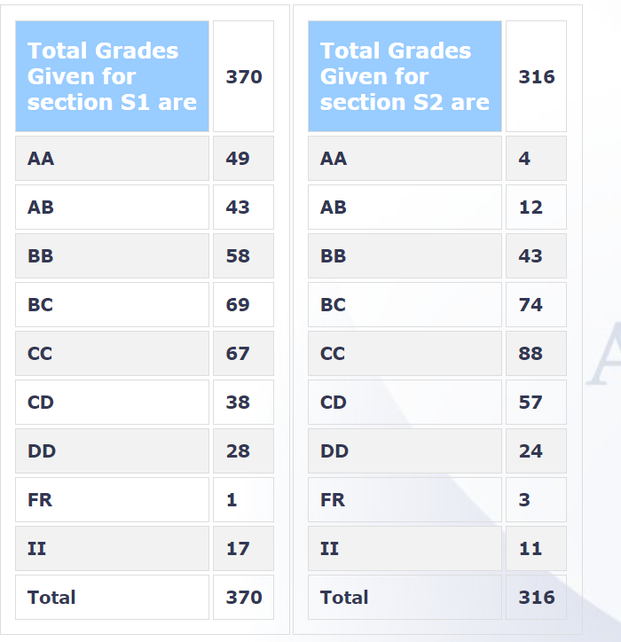

-   **Your Name and Batch**: 

    Tanmay Joshi, 2024 (B Tech)

-   **Course Offered In**:** 
    
    Autumn 2021-22

-   **Instructors**: 
    
    Prof Ronnie Sebastian

-   **Prerequisites**: None technically, but this course is done after MA108

-   **Difficulty**: On a scale of 1 to 5, this course would be at a
    difficulty of 1 /5. The course content was simple enough to
    comprehend, and the exams were easy to score good.

-   **Course Content**: The course aims to teach you solving differential
    equations and learning methods to obtain solutions of ODEs.It
    started off with convergence, power series, solving differential
    equations using power series, and moved on to Legendre equations,
    Legendre polynomials and their properties, regular singular cases of
    differential equations, the Bessel equation, Eigen value problem,
    Fourier series, Partial Differential Equations, wave equation with
    Dirichlet and Neumann boundary conditions, and the heat equation.

-   **Feedback on Lectures**: The lectures were good and sufficient to
    understand the course content, but attendance dwindled gradually.
    Slides were very detailed and really good, and along with the
    tutorials, were enough to get a good understanding of the content.

-   **Feedback on Evaluations**: The course had one quiz worth 40% weightage
    and one endsem worth 60% weightage. Both the exams were
    straightforward, and had questions straight from the tutorial sheet
    itself. Grading was decent, but grade margins were very close to
    each other, given the lack of difficulty in exams. A partially
    absolute grading scheme was in place, where less than 30% score led
    to an FR grade.

-   **Study Material and References**: Slides and tutorial sheets were more
    than sufficient.

-   **Follow-up Courses**: -

-   **Grading statistics**:  
    

-   **Final Takeaways**: The course built-up on differential equations after
    MA108, and turns out to be quite useful in certain fields and
    aspects. Various beautiful methods of solving ODEs were taught.
