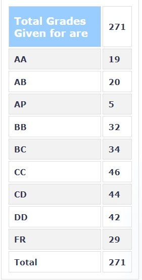

**Your Name and Batch**

Ronil Mandavia 

**Course Offered In**

Spring 2021

**Instructors**

Prof. Sudarshan Gurjar

**Prerequisites**

None 

**Difficulty**

On a scale of 1 to 5, with 1 being the least difficult and 5 being the most: 4/5

**Course Content**
* Analytical functions
* Cauchy-Reimann equations
*  Harmonic functions
*  Power series and their properties
*  Elementary functions
*  Cauchy's theorem
*  Taylor series and Laurent expansions
*  Residues and the Cauchy residue formula
*  Improper integrals

**Feedback on Lectures**

Lectures were slow paced and the instructor mainly followed his slides while teaching. As ours was an online batch, the course had no attendance policy. The lectures were monotonous at times, but reading the slides made up for it. The professor cleared all the doubts we had in the class itself. The course becomes a bit difficult during the latter half so attending the lectures seriously is advisable. 

**Feedback on Evaluations**

As with most MA courses we only had one quiz and a midsem which served as the final evaluation for the course. As the course was conducted in an online fashion both the exams were objective and silly mistakes were heavily penalized. 
Quiz - 40%
Midsem - 60%

**Grading Statistics:** 

**Study Material and References**

Complex Variables and Applications Seventh Edition by James Ward Brown and Ruel V. Churchill 

**Follow-up Courses**

MA 412-Complex Analysis

**Final Takeaways**

Complex analysis is a beautiful topic and has applications in signal processing and control theory and I would suggest everyone to give the time the course deserves to fully comprehend it as the content is very rewarding.