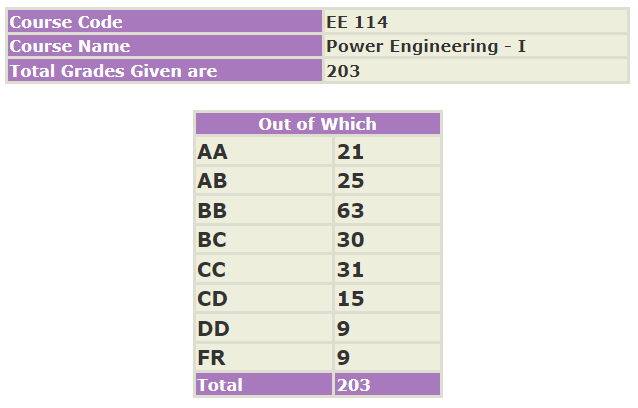

### EE 114 – POWER ENGINEERING – I

**Course offered in:**

Spring 2021

**Instructors:**

Prof Himanshu Bahirat
Prof Shreevardhan Soman

**Course Content:**

Single phase AC system, Solving circuit equations for current, voltage and power of AC circuit by means of phasors. 3 phase AC system and analysis of balanced and unbalanced circuits. Magnetic circuits and their solving methods by comparing them to electric circuits. Single phase transformer and its equivalent circuit, auto transformers and brief info on 3 phase transformers. Induction motor and DC motor.

**Prerequisites:**

Apart from basic calculus and physics which was part of JEE, there are NO other prerequisite. Some sophomores were also a part of the course.

**Feedback on Lectures:**

Lectures were recorded and the pace was slow at the start of the course. Pace increased suddenly after the Midsem. Professors teaching in recorded lecture was good enough, but due to circumstances, live interaction sessions for doubts were less.

Feedback on Tutorials, Assignments and Exams:

Assignments helped a lot in grasping the concept taught in lectures and had good questions. Exams were upto the point and completely based on taught syllabus only.

**Difficulty:**

The course was easy before Midsem. The next part of the course was difficult or fast paced.

**Grading Statistics:**

**Study Material and References:**

Electric Machinery by Fitzgerald, Charles Kingsley Jr and Stephen D. Umans was the most widely used book as reference and for problem solving.

**Takeaways from the course:**

This course seems to be a basic course on working of motors and transformers which are the most widely used electrical devices. So, they shall help in further courses on these topics. This course also adjusts to the type of methods and approximations techniques that shall e required in next courses.

Review by – Kunal Randad (krandad@gmail.com)
