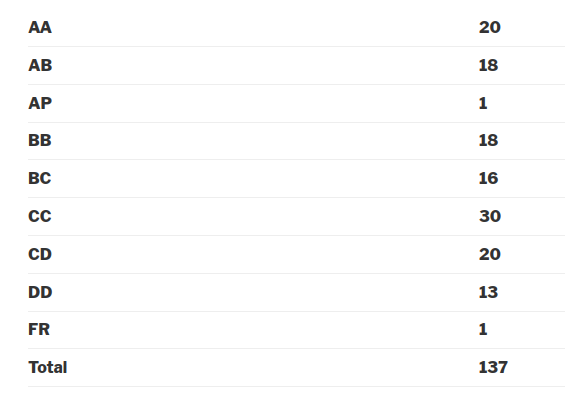

---
layout: page
title: Course Reviews
subtitle:
cover-img: assets/img/Cover_study.jpg
thumbnail-img: ""
share-img: ""
comments: true
tags: [Academic]
---

### EE 222 – Electrical Machines and Power Electronics

**Course offered in:**

Spring 2017

**Instructors:**

B.G.Fernandes

*Motivation*

The course is an extension to EE111 and introduction to power electronics. A lot of practical and interesting concepts are taught in the course like design of mobile chargers, tackling problems related to power generation from renewable sources like photovoltaic cells and windmills, etc.   

**Course Content:**

* Power semiconductor devices
* DC to DC converters
* DC to AC inverters
* AC to DC rectifiers

**Prerequisites:**

EE111, the professor expects students to know concepts of electrical machines very well and directly starts teaching power electronics.
**Feedback on Lectures:**

The professor demands absolute attention from the students. It is imperative to revise the previous lecture and try out all questions asked by the professor in the class. The professor taught on the blackboard but the slides were also made available. Lectures were a little difficult to follow but could be understood if supplemented with regular revision.
The questions asked by the professor in the class were extremely important and constituted large part of questions asked in the exams. Needless to say, it is necessary to figure out the questions by yourselves or by asking the professor.
**Feedback on Tutorials, Assignments and Exams:**

One assignment was provided for DC to AC inverters which was later taken into consideration for grading. Tutorial sessions were held and mainly constituted discussions on doubts raised by students and questions asked by the professor in the class. Problem sets were a luxury because the professor stressed heavily on concepts and attempting exams with an ‘open mind’. 

Best 2 out of 3 quizzes constituting 15%, an assignment constituting 5%, midsem constituting 30% and the end semester exam constituting 50%.
The exams were on the difficult side with many conceptual and design questions. A few numericals were also asked and they too were difficult.

**Difficulty:**
8 on a scale of 10
**Grading Statistics:**

Review by – Anmol Kagrecha (akagrecha@gmail.com)