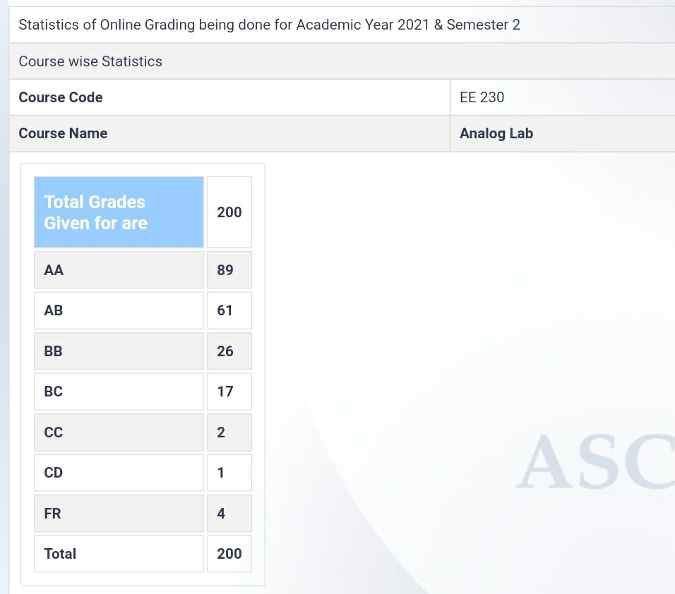

**Review by**

Annie D’souza, DD(2025)

**Course Offered In**

Spring 2022

**Instructors**

Prof. Anil Kottantharayil

**Prerequisites**

 EE 204 

**Difficulty**

Moderately Easy (2 out of 5 with 5 being the hardest)

**Course Content**

This lab involved simulating various circuits on NGSpice as well as building circuits on breadboards - ones that utilized OpAmps, BJTs and other ICs along with the usual capacitors, resistors, etc. The supply to the circuits was from a function generator while measurements were to be made using a Digital Storage Oscilloscope (DSO). We had to submit lab reports every week- these were to be strictly made in LaTeX and the circuit diagrams included, in X-circuit. Each week’s experiments were on topics that we’d already done previously in some theory course so the labs were fairly easy. 

The experiments covered were:
Lab1: Introduction to NGSpice
Lab 2: DC Power Supply
Lab 3: Half-wave and full-wave precision rectifiers
Lab 4: Schmitt trigger, Astable mulitvibrator, Monostable mulitvibrator
Lab 5: Photodiode application circuit,  Instrumentation Amplifier
Lab 6: Measurement of non-ideailties in an OpAmp
Lab 7: Active Filters
Lab 8: Log Amplifier
Lab 9: Instrumentation Amplifier on load cell sensor
 
**Feedback on Lectures**

Pre-midsem, the lab was conducted online and offline post-midsem. The online half only involved circuit simulation while the offline half had both simulation as well as building physical circuits.

Every week, we were given homework (circuit simulation in NGspice) that had to be completed before the lab session. The homeworks weren’t very time taking nor were they conceptually tough. Each lab session began with a 10 minutes moodle quiz. Study material for the week’s topic was provided in advance and the quiz consisted of both theory questions and questions involving calculations. The labs themselves involved forming actual circuits, supplying inputs to it and taking readings, usually followed by plotting the results / characteristics. The TAs were quite helpful so almost everyone completed the lab on time. Making LaTeX reports every week though, was a little annoying as it usually took more time than the homework itself!

**Feedback on Evaluations**

The mid-sem and end-sem required formulas and calculations before getting to the actual circuit simulation/ building. So going through every week’s study material was a necessary preparation. Once you did have your hand-drawn circuit ready, the simulation/ building part was relatively straightforward.

**Study Material and References**

No external study material was required, we were always provided with any theory necessary to supplement the lab. 

**Follow-up Courses**
 

**Final Takeaways**

You do get a lot of practical experience in this lab course and it doesn’t require a lot of time commitment. If you complete each week’s lab experiment and homework and go through the supplements provided for the exams, you’ll end up getting a decent grade in this course.

**Grading Statistics:**

The professors were quite generous with the grading. Here are the grading statistics for our year:

