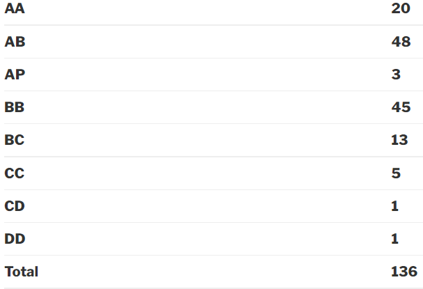

### EE230:Analog Lab

**Year:** 2017-18 Spring Semester

**Instructor:** Prof. Siddharth Tallur, Prof. Narendra Shiradkar

**Motivation:**

This lab supplements the EE204(Analog Circuits) theory course. It will help in appreciating the concepts learnt in class as you will perform the experiments and see them in action. In my semester many new experiments were introduced. The initial experiments helped in understanding concepts more thoroughly and helped with circuit building and debugging skills. Later half of the experiments focused more application based experiments like audio amplifier and ECG.I personally enjoyed the later half experiments. Last 3-4 weeks were for lab project.

**Course Content:**

The lab will involve extensive use of breadboard, OPAMP ICs, MOSFET and BJTs. So by the end of the lab you will have gained enough skills in handling them. Also in my semester the lab reports were to be made compulsorily on Latex and the plots were to be plotted using proper softwares like Gnuplot. So by the end of the semester I was pretty comfortable in using these softwares.

Sr. No.	Experiment Name
1	Difference Amplifier and Current Mirror
2	Non Idealities of OPAMP
3	Instrumentation Amplifier
4	Analog Multiplier
5	Precision and LDO rectifier circuits
6	Audio amplifier
7	Filter circuits
8	Phase Sensitive Detection Circuits
9	PSD Application
10	ECG Circuits
11	Lab Project/Design Challenge
 

**About Lab Sessions:**

Before coming to the labs we were required to complete the pre-lab work, but in most labs it was nothing more than reading the lab material available through wel lab website. The lab sessions required to build the circuits following the steps giving in the lab material and taking the readings. Students were divided in pairs and 2 such pairs was allotted one TA. Most experiments were completed in time,but some required more time and we were allowed to go to lab on free day to complete it. Post lab work required to make report in Latex and using Gnuplot or other such softwares for plotting. In start it took time to get used but soon it became easy. Still lab reports were time consuming for me.

Lab session account for total of 30% of final marks.

Plagiarism it not tolerated at all, professional software Turnitin was used in my semester to capture all the ones who copied.

**About Exams:**

There were 2 exams in my semester(Mid-sem and End-sem). Also professor once took a surprise quiz in start of the lab session to test whether students read the lab material (pre-lab work) or not. The weightage of the exams were 20% for Mid-sem and 30% for End-sem exam. Exam were in moderate to difficult level for me. They required proper understanding of the underlying concepts of lab experiments and their applications. Also for those who performed too bad in the exams were given another chance too as a reexamination.

**About Lab Project(Design Challenge):**

It got very hectic in the last 3 weeks before End-sem due to this project(and Digital lab course – EE214). In my semester projects were distributed to students randomly by professor through a pool of projects, but it was allowed to select a different topic too given it must be not from the pool of the projects given by professor. It required to first do simulations and make a simulation report after which proceeding to making the project on breadboard. This project required significant amount of time as we built and tested many circuit before reaching to a final one. Finally we had lab project demo session held in which many different professors(not just the instructors) judged the many projects and graded them.Also exceptional projects were rewarded by the professor.

The lab project account for 20% of the total.

**Difficulty:**

Course was pretty easy but it required time for lab session post lab report especially in the start. As per exams they were slightly tricky. And lastly lab project was a bit ill-timed as it was just before End-sem and it required time for completion.

**Grading Stats:**

Grading was bit strict than earlier year but its still good.

