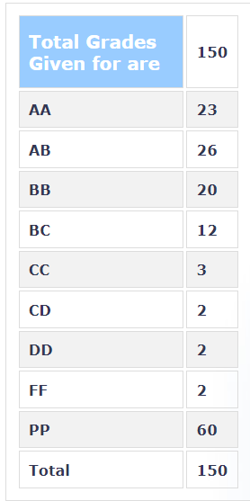

**Instructor:**

Prof. Anil Kottantharayil and Prof. Rajesh Zele

**Session:**

Spring 2020

**Prerequisites:**

N/A

**Course content and structure:**

This was a weekly lab. Most of the experiments were based on operational amplifiers, some experiments included using then along with transistors. Some of the circuits that were built are 1. Instrumentation Amplifier 2.Adder 3.Subtractor 4.PSD circuits 5. Voltage-controlled amplifiers etc. the detailed list of experiments can be found here: http://wel.ee.iitb.ac.in/teaching_labs/WEL%20Site/ee230_temp/Labsheets-2019/labsheets_2019.html

**Feedback on lectures:**

As this course is complemented with ee204, all the necessary theory is covered in ee204 itself, however professor and RAs give a brief about the concepts not taught in ee204 before every lab. Also the lectures held in lab consisted mainly on how to use particular instruments if that was introduced for the first time in course. The lectures are fairly brief and short.

**Feedback on tutorials and exams:**

Only exams conducted are midterms and end terms, talking about midterms, they are moderate in difficulty level, where one of the section is relatively easy and straight forward, the next section is not so straight forward but is somewhere modified form of an experiment already done in labs, and the last part consists of the section which requires a good understanding of subjects and needs to apply them correctly, this section is fairly tough. you are also evaluated on the basis of your lab performance as RAs take viva at the end of every lab so it’s mandatory to study the lab experiment in advanced

**Difficulty (on a scale of 1 being very easy to 5 being very hard):** 2

**Textbooks & References:**

References for every lab experiment are listed on WEL website, Also EE204 lectures are a good resource for this lab

**Grading Statistics:** 

**Additional comments & what you learnt from the course:**

 This is one of the first exposure to operational amplifier based circuits which are widely used so great opportunity to get acquainted with them, All things that you learn in theory course EE204 are applied and tested in real life, so great coherent learning experience