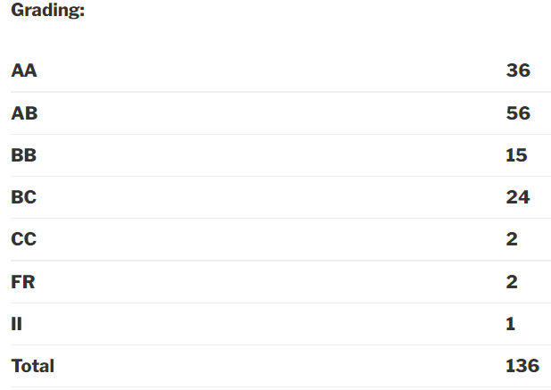

### EE234: Electrical Machines Lab

**Semester:**

 Spring 2017

**Professor:**

 Kishore Chatterjee

**Motivation:**

To aid understanding and provide additional information about electrical machines and supplement to EE111 and EE222(Electrical Machines and Power Electronics)

**Course Content:**

There were 5 experiments and several demonstrations that greatly supplemented to the understanding of electrical machines. A lecture was held before each experiment in which the professor explained the relevant theory. Lab manuals and additional material for the course can be found here.

**Evaluation:**

There were no quizzes, mid-semester exam or end-semester exam. Evaluation was done on the basis of viva conducted by the professor and the report submitted to the TA after each experiment.

**General Information:**

 The professor is very strict regarding the following –

Time at which the experiment starts.
Reading the manual before performing the experiment.
Attending the lecture held before the experiment.

**Grading:**

**Difficulty:**

 Easy

Reviewed By – **Anmol Kagrecha** (akagrecha@gmail.com)
