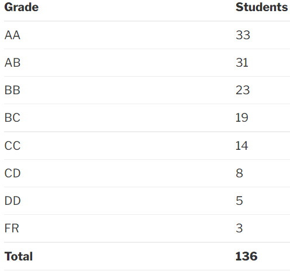

### EE 236 – Electronic Devices Lab

**Professors:**

 Anil Kottantharayil, Brij Mohan Arora

**Course offered in:**

Spring 2017

**Prerequisites:**

 None

**Motivation:**

 To enhance the understanding of the topics in EE 207 – Electronic Devices

**Course content and structure:**

This lab is held in close conjunction with the Electronics Devices lab and there are practical experiments based on almost all the topics of the course. NGSPICE as a software is an integral tool that is taught in this course.

There were a total of 10 experiments covering the characterization of various electronic devices like simple PN junction diodes, zener diodes, LEDs, solar cells, MOSFETs, etc.

Every experiment consisted of 3 parts – Pre-lab simulation (on NGSPICE), In-lab work (the actual experiment) and post-lab work (analysing the data and report).

This course, being the first lab course in the department, would also act as in introduction to various lab equipments like DSO, function generator, multimeter, etc.

Almost all the labs consisted of measuring I-V characteristics and plotting them on a graph through a software of one’s choice (Excel, GNU plot, MATLAB) and then analysing the data to deduce certain results or calculate the values of various parameters associated with the function of the DUT (device under test).

**Feedback on lab experiments:**

The experiments are easy to perform. They gave a basic overview and validation of the concepts taught in the electronics devices course, but the lab work seemed very monotonous and not requiring much thinking on our part. It definitely demanded much more work than the credits allotted to it. Be prepared to be copying dozens of similar images for your pre-lab assignments and simulations, and with very less weightage given to the same.

**Difficulty:**

Easy

**Evaluation:**

There were two midsems – one based on NGSPICE simulation (15%) and the other based on the actual hands-on experiment (25%). The experiment in midsem was not one that had been done earlier, but was based on the concepts already taught in EE 207.

The endsem didn’t have any simulation part and accounted for 30% of the marks. The rest of the marks (30%) were In-session marks that followed the pattern of 5 (pre-lab) + 10 (in-lab performance) + 5 (post-lab) = 20 points (scaled down) for each experiment.

**Grading:**

Expect a decent grading pattern, and not too many AAs unlike the first year labs.

Here are the grading statistics for AY 2016-17:

Reviewed by **Anmol Gupta** (iitb.anmol@gmail.com)
