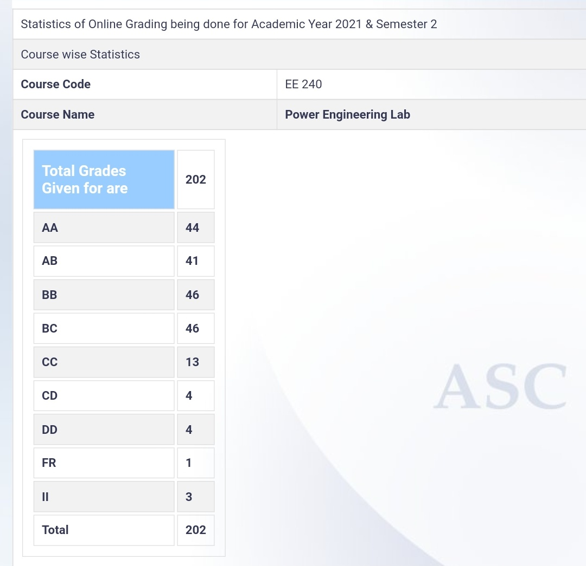

**Review by**

Gouri S Dev, BTech (2024)

**Course Offered In**

Spring 2022

**Instructors**

Prof. Baylon G Fernandes, Prof. Sandeep Anand

**Prerequisites**

EE 238 (runs parallely) and EE 114

**Difficulty**

Moderately Easy (2 out of 5 with 5 being the hardest)

**Course Content**

The first part of the course was online and required us to attend online lectures, read lab sheets, watch videos of the experiments being performed and then take weekly quizzes (subjective). 

Once the labs shifted offline, there were lab sheets uploaded detailing the week’s experiment, a short lecture before the lab, and the experiments had to be performed in groups of four. 

The labs conducted had experiments involving transformers, induction motors, DC motors etc. and a demonstration on synchronization in the end.
 
**Feedback on Lectures**

During the online half of the course, there were lectures detailing the theory being used in the week’s experiment and the professor would then go over a video of the experiment being performed in the lab. The questions asked in the weekly quizzes were usually concepts  covered in the lecture and not always present in the lab sheet so it was important to pay attention.

Once the lab shifted offline, it was the experiments discussed online in the first half that were being performed so there were only short lectures before each lab. The questions asked in the viva were now mostly from the lab sheets or theory covered in EE 238 but the lectures themselves were fairly interesting.

**Feedback on Evaluations**

While the course was running online, we had to give written exams based on the previous week's lectures which meant that it felt more like a theory course than a lab. Once the labs started happening offline, you were evaluated on the basis of how well you did the experiments and answered the viva questions. This was simple enough if you had gone through the lab sheets and watched the videos uploaded. Also, the TAs usually help a lot.

The endsem was a written exam with a number of short questions about various experiments.

**Study Material and References**

The lab sheets and video demonstrations uploaded were sufficient. No extra study material was required.

**Follow-up Courses**
 

**Final Takeaways**

The course gives you an opportunity to put the theory learned in EE 114 and EE 238 to use and helps you understand the concepts better. The course is also fairly easy and you can end up getting a decent grade even without much time commitment.

**Grading Statistics:**
