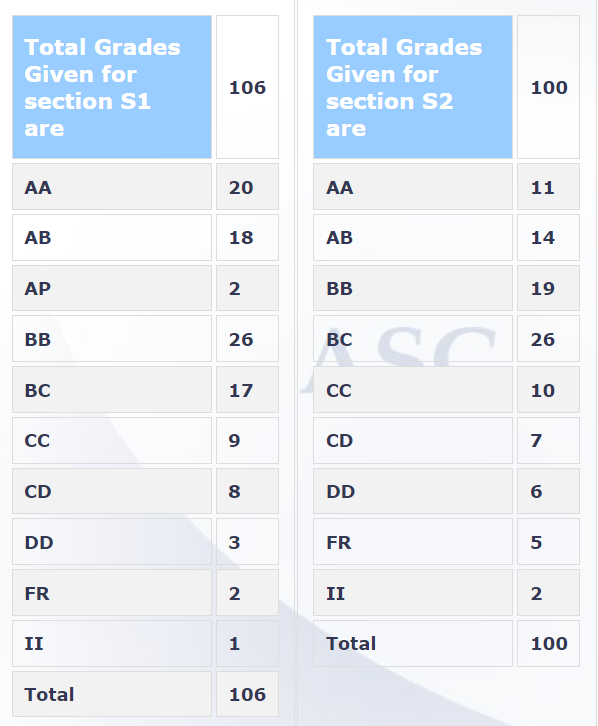

**Review by**

Kushagra Mishra (2024 BTech)

**Course Offered In**S

Spring 2022

**Instructors**

Prof. Dwaipayan Mukherjee

**Prerequisites**
None

**Difficulty**
2/5

**Course Content**
Notion of feedback, open- and closed-loop systems 
Modelling and representations of control systems: Ordinary differential equations, Transfer functions, Block diagrams, Signal flow graphs, State-space representations 
Performance and stability: Time-domain analysis, Second-order systems, Characteristic-equation and roots, Routh-Hurwitz criteria 
Frequency-domain techniques: Root-locus methods, Frequency responses, Bode-plots, Gain-margin and phase-margin, Nyquist plots 
Compensator design: Proportional, PI and PID controllers, Lead-lag compensators 
State-space concepts: Controlability, Observability 

**Feedback on Lectures**
For the first half of the course, the entire course's content was uploaded on YouTube along with a week-wise schedule. The recorded lectures (a few of Dwaipayan Mukherjee and the rest of Madhu Belur) were pretty good for the part. They were exciting and relatively easy to follow. The prof. also took weekly interactions where he would go slightly deeper into the previous week's concepts and try to give us a good background. The latter half of the course saw offline lectures being conducted in the regular slots, which were again extremely interesting. The prof. does a fantastic job of building a strong intuition to all of the concepts instead of forcing to mug formulas up. The offline lectures were slightly fast paced. It is highly recommended to not skip any lectures (especially State Space methods) since lecture contents are a mixture of a variety of reference textbooks and no good effective reference can be suggested for these lectures.

**Feedback on Evaluations**
    * Assignments: 10%
    * Quizzes: 10% (each)
    * Midsem: 30%
    * Endsem: 40%

The prof. shared regular assignments which were easy but time-taking. The assignments were a good way of keeping up with the course as they were related directly to the lectures. There were quizzes too which were also based on lecture content but were significantly harder due to time constraints. There were a total of 3 quizzes (1 in the first half and 2 in the second half). Midsem and Endsem were along the similar lines to quizzes.

**Study Material and References**
    * Norman N. Nise, Control Systems and Engineering

**Follow-up Courses**
    * EE 640 : Multivariable Control Systems
    * EE 749 : Decentralized Control of Complex Systems

**Final Takeaways**
The course is not very difficult, but does require time to understand its concepts. The topics covered are extremely interesting and provide a good way to enter the inter-disciplinary world of control systems. 

**Grading Statistics:**
