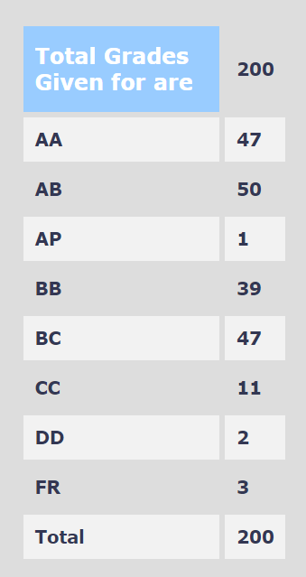

-   **Your Name and Batch**: Tanmay Joshi, 2024(B Tech)
-   **Course Offered In**:** Spring 2020-21
-   **Instructors**: Prof. Virendra Singh
-   **Prerequisites**: EE224 in some aspects.
-   **Difficulty**: The topics are at a moderate level of difficulty but
    fairly understandable if you are attentive in all lectures.
-   **Course Content**: In order, the course contained instruction set
    architectures, microprocessors like 8085, 8051, instructions for
    8051, assembly language programming, timers, interrupts, delays,
    peripheral interfacing, instruction hardware flowcharts,
    microprocessor architectures like RISC(Reduced Instruction Set
    Computer) and CISC(Complex Instruction Set Computer), multi-cycle
    and single-cycle processors, processor pipelining and cache memory.
-   **Feedback on Lectures**: Lectures were taught in great detail and the
    instructor taught concepts so that they were intuitive. Sometimes
    topics were repeated a few times and it was ensured that everyone
    who paid attention could understand them. The instructor gave many
    examples time to time and explained concepts thoroughly. The first
    half majorly involved assembly programming, and in the second half
    the instructor explained processor architectures using some example
    ISAs and processors.
-   **Feedback on Evaluations**: Evaluations were a black box and the exact
    weightages were not known at all, but the final grading can be
    classified to be fairly lenient. There was one assignment, one
    midsem, one endsem, one project and one bonus project involved. The
    exams were not time limited and you could take up as much time as
    you want.
-   **Study Material and References**: Some reference books might be needed
    for revision, like Mazidi and Ayala.
-   **Grading statistics**: 
    
-   **Follow-up Courses**: CS683, EE677, EE739 can be taken up after this
    course.
-   **Final Takeaway**: EE309 is an amazing course which introduces you to
    many aspects of processors and their applications in real life, and
    it is beautiful to get to know how every component or block takes
    its place in the working of the entire microprocessor, ultimately
    explaining you the basics behind the workings of microprocessors.
