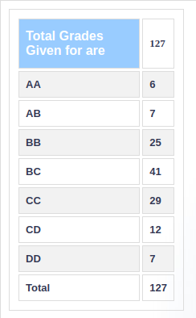

### EE 328 – DIGITAL COMMUNICATIONS (B. TECH) 

**Course offered in:**

Spring 2018

**Instructors:**

Prof. Kumar Appiah

**Course Content:**

May vary slightly depending on the instructor but in a broad sense the content covered is as follows -:

1. Review of Random Processes and Spectral analysis
2. Optimum detection of signals in noise
3. Probability of Error evaluations
4. Baseband Pulse Transmission, Intersymbol Interference and Nyquist criterion
5. Passband Digital Modulation schemes- Phase Shift Keying, Frequency Shift Keying
6. Quadrature Amplitude Modulation
7. Phase Shift Keying and Digital Modulation tradeoffs
8. Optimum demodulation of digital signals over bandlimited channels
9. Maximum likelihood sequence detection (Viterbi receiver)
10. Equalization Techniques and basics of Information theory

**Feedback on Lectures:**

The course content was not very coherent, and the lectures were mostly precipitous. The instructor taught on the board and reading material was uploaded regularly, which was very helpful for understanding the lectures. The course is a bit mathematical, hence the instructor tried to follow a standard book, but the notations and terminologies were a bit too overwhelming for some topics. One needs to be patient and focus more on the concept, else it is very easy to be bogged down by notations. The instructor tried his best to keep the lectures lucid enough, and was very receptive to doubts asked in the lecture. He ensured to arrange contact hours before quizzes and exams to discuss tutorials and doubts. Solving tutorials was very important for this course to do well in examinations. The instructor made it very clear in the beginning of the course itself, that the exams would be based on the tutorials. The instructor maintained a strict attendance policy and DX was awarded to students with low attendance.

The quizzes were easy and straightforward. They were mostly based on the tutorial problems. The midsem and endsem exams were conceptually not very challenging but quite calculative and lengthy. Referring the textbook, reading material and solving the tutorials was more than enough to do well in the course.

There was no course project. The instructor uploaded tutorials regularly. Some questions of the tutorials were based on simulations. Some of the the tutorials problems were challenging. The instructor often gave textbooks exercises as tutorials, which comprehensively addressed all the concepts covered in class.

**Difficulty:**

Overall the content is not very difficult, but does require frequent revisions to understand where the course is going.

**Grading Statistics:**

Moderate

**Study Material and References:**

1. Digital Communications, S Haykin
2. Fundamentals of Digital Communication, Upmanyu and Madhow
3. Principles of Communication Engineering, Wozencraft and Jacobs   