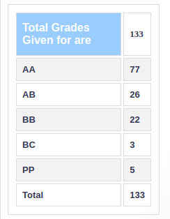

### EE 334 – POWER SYSTEMS

**Course offered in:**

Spring 2019

**Instructors:**

Prof. Anupama Kowli

**Course Content:**

The power distribution grid on a large scale, from characterising transmission lines, to whole networks, power generation, a little bit of economics, fault conditions and protection, and reasons and prevention of blackouts.

**Prerequisites:**

None.

**Feedback on Lectures:**

Lectures were very good, well explained. The Prof taught well and made the content very practical and hence interesting. I recommend listening in class because some topics were better understood in class itself.

Assignments were compulsory to attend the exam. They were time consuming but were very good practice for the tests. Done in groups. I recommend doing them. Exams were moderate overall. However, the course content is a lot if one does not keep up with the lectures, and hence might find it difficult.

I strongly suggest paying attention in class, it will make the course much easier and easy to follow. You will also understand why we are learning all that theory.

**Difficulty:**

4 (on a scale of 1-5 with 5 being very tough)

**Grading Statistics:**

**Study Material and References:**

I felt that slides and borrowed lecture notes were sufficient

Reviewed by - Kumar Ashutosh