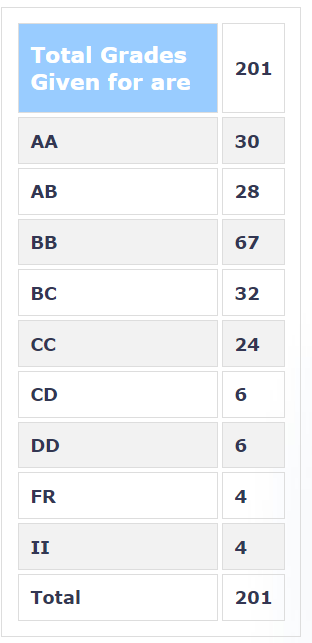

**Review by**

Nikhil Kaniyeri, 2024 (B. Tech)

**Course Offered In**

Spring 2022

**Instructors**

Saravanan Vijaykumaran, Nikhil Karamchandani

**Prerequisites**

EE309 - Microprocessors, can do parallely in semester

**Difficulty**

The labs are sufficiently easy, if you understand the working of an 8051 microprocessor.

**Course Content**
	
All students were given an 8051 development board (PT-51). The course followed the Microprocessor course heavily. The first 7 labs covered Assembly programming in 8051, and the last lab covered programming in Embedded C. Each lab builds up over the previous lab, so it is important to understand the content of every lab. Programming in assembly language comes with its own quirks, so make sure you are familiar with the software and understand the concepts of timers and counters very well in your Microprocessor course. Both courses were run in sync, so there was no need to read up ahead of time. The labsheets were uploaded in the week, and we were expected to complete coding it and upload it to Moodle by Sunday evening. The evaluations were scheduled in the lab slots.

**Feedback on Labs**

The course covers assembly language programming extensively. It is important to understand the flow of assembly programs and 8051 instructions with its associated registers. It is also necessary that you understand how to debug an assembly language program, because the logical errors are not as obvious as compared to a C program; so make sure you are familiar with the software (ARM Keil µVision 5).  

The Embedded C section is fairly easy if you have prior C experience. The course did not cover this section in depth, limiting oneself to filling up certain values for communication protocol functioning. The focus here was more on understanding how to read datasheets and trying to find out what values of registers would correctly implement the timing diagrams provided.

**Feedback on Evaluations**

Lab-wise evaluation: Every lab had an associated viva where questions were asked about the code that was submitted. There were questions asked on the underlying theory as well, so make sure you understand it. Also, in the labsheets on communication protocols, questions were asked on the protocol itself, although it was not covered anywhere, so make sure you read up on how the protocol works, and the associated pins for the protocol to work.  

End-Sem: It had questions both on assembly programming and embedded-C. The questions were fairly straightforward, but most people ran into hardware issues, and sorting them out was difficult. Make sure you test out all your hardware before going in, and do remember all of the quirks. One major issue most people faced was the UART module not functioning, so make sure you remember how to reinstall the drivers for the same.

**Study Material and References**

Slides of Microprocessor Course \
Kenneth Ayala, 8051 Microcontroller: Architecture, Programming and Applications

**Follow-up Courses**

None

**Final Takeaways**

In a nutshell, the course is fairly straightforward if one follows the shared resources and starts working on the weekly assignments well in advance.

**Grading Statistics:**
