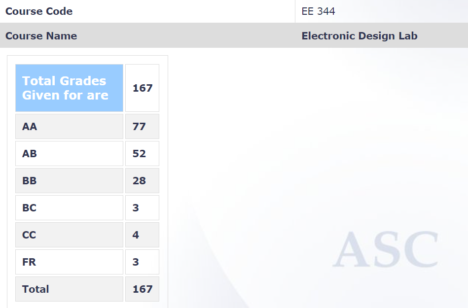

**Review by**

Suraj Sarvesha Samaga, 2023(BTech.)

**Course Offered In**

Spring 2022

**Instructors**

J.John (main instructor), Kushal R. Tuckley, Pandey P.C., Siddharth Tallur

**Prerequisites**

All core labs up till sem 6 in the curriculum.

**Difficulty**

4/5

**Course Content**

The professors roll-out their projects at the start of the course and students are expected to form groups of 3 and write a proposal for a project - after which every group is assigned a project. The first month was essentially spent with the professors teaching topics relevant to projects, such as:

- TTL Gates and Families
- TTL Interfacing Circuits
- Open-Collector Gates
- Single Supply OPAMP Circuits
- Clock-Generation Related Circuits
- Signal, System, & Interconnection Basics
- PCB Layout Design for Circuit Assembly
- Basics of reading a datasheet
- Noise Analysis
- OPAMP Basics

Just before midsem, there was a PCB Design assignment, wherein every group was assigned a particular circuit for which they would have to do the layout in EAGLE.

**Feedback on Lectures**

Lectures were mostly to give a broad idea to all groups about each topic. Slides/notes were shared post-lecture. Other than this, every week starting from the second month, each group would have to spend 3 hours in the lab slot working towards a solution for the assigned project. It is advisable to break down the project goal into smaller sub-goals and chalk them off one by one. The ideation can be done together, but the execution work can be split among the team members for efficient work. The final goal of each project was more or less to come up with a working circuit on a PCB. 
The lab attendants (esp. Maheshwar sir) were extremely helpful in troubleshooting and even organized extra lab sessions on non-lab days towards the end to ensure completion of each group's project.

**Feedback on Evaluations**

1. 30% Midsem
2. 70% Project

Most of the midsem content was from the lectures, and was of a fairly high difficulty. Progress of each group was monitored every week and the project grade depends on the group's involvement, effort put in, and of course, the end product. Each group was supposed to submit a final project report and demonstrate the working of their project a week before endsems, followed by a viva.

**Study Material and References**

Study material for the common lectures were uploaded by the professors from various reference books. Other study material is on a per-group basis and cannot be generalized.

**Follow-up Courses**

**Final Takeaways**

This is the only 6-credit core lab course in our curriculum and is not to be taken lightly. This course enables each student to get some sort of hands-on learning in EE to supplement the theory learnt thus far, and the opportunity to pursue a graded project from start to finish.

**Grading Statistics:**

