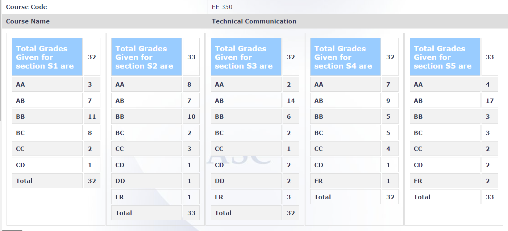

**Review by**

Shreyas Nadkarni, 2019-24 batch (IDDDP)

**Course Offered In**

Spring 2022

**Instructors**

Prof. D. Manjunath, Prof. S.V. Kulkarni, Prof. Satish Mulleti, Prof. Shiladri Chakraborty, Prof. Debanjan Bhowmik

**Prerequisites**

None

**Difficulty**

2/5

**Course Content**

- English grammar: Articles, Prepositions, Active/Passive Voice, etc
- Comprehension
- Plotting, charts, pictorial representation of information
- Ethics: Code of conduct in research, citation methods, plagiarism rules and types
- Technical writing: LaTeX, tips on writing good summaries and reports, using Grammarly
- Oral presentation

**Feedback on Lectures**

Lectures were online during the hybrid semester. The topics were split among the 5 professors. The initial lectures covered basic grammar (10th std types). The lectures were useful for someone who really wants to improve their English, writing skills, speaking skills, etc. Tutorial sessions were taken separately in sections, and they consisted of ungraded Moodle quizzes for practice. These quizzes helped in practising what was taught in the lectures, and I found them engaging. 

**Feedback on Evaluations**

1. 20% presentation (on an assigned paper)
2. 30% report in LaTeX (on the same assigned paper)
3. 50% endsem

The evaluation was done in 5 sections, separately by each Professor, and there was a disparity between sections. In the report, marks were cut for things such as spelling mistakes, grammatical mistakes, etc. or plagiarism (sections taken verbatim from the assigned paper or if there is too much similarity). In the presentation, marks were cut for things such as not citing images at exactly the same places, not citing the paper at the beginning, etc. The endsem was partly similar to a 10th std English grammar paper, with questions on articles, tenses (fill in the blanks, etc.), comprehension, etc. There were some additional things, such as summarising a paper (which was given in the exam) in limited words, presenting information from a textual piece in the form of a graph or charts, and some questions on the ethics section (for which the slides are enough). For the English part, someone who is well-versed in basic grammar can easily ace the exam. 

With respect to time commitment, major time was spent on drafting the report, around two weeks prior to the endsem. (Suggestion: Do not start it at the last moment, and try to learn LaTeX in advance if you haven't already. And Grammarly is a useful tool).  
Note: In the offline sem, there might be some continuous evaluation (quizzes, midsem, etc.) because during our year, the sem was hybrid, and the Profs had not figured out a way to evaluate us (while ensuring that we did not cheat). Therefore the entire evaluation was done towards the end when the force of the third Covid wave reduced, and offline presentations and endsem were possible. 

**Study Material and References**

The slides given by Profs are sufficient.

**Follow-up Courses**

None

**Final Takeaways**

This is a unique course in the curriculum, and students tend to consider it useless. But in my opinion, it is an essential course because conveying your work to others through technical writing or presentations forms an important part of our careers, no matter whether it's research or industry or something else. We are usually not taught how to do it effectively otherwise. It will directly help in drafting reports for BTP/SRE/RnD/DDP since it will give you a chance to learn LaTeX and make a presentation in front of people. It will also sensitize you to the rules and considerations one needs to understand concerning plagiarism. It can also help in exams containing an English component (such as GRE, TOEFL, etc.).

**Grading Statistics:**

