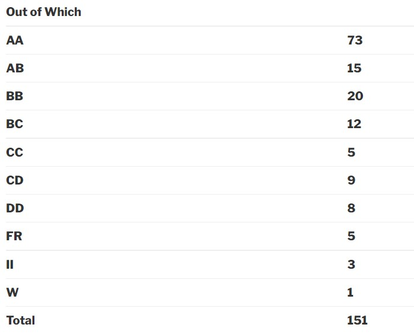

### EE 214 – DIGITAL CIRCUITS LAB  

**Academic year:** 2017-2018

**Semester:** Spring

**Course Instructor:** Prof. Madhav P Desai

**Motivation for this course:**

EE214 is a compulsory 4th semester core course of the Electrical Engineering department. This lab course runs in parallel with the theory course EE-224 which is also taken by the same professor every year. The main aim of this course is to give you a touch of Digital System Design. One of the really important realizations about this course is that Digital System Design is very different from a typical Digital Circuits course. While a Digital Circuits course would focus more on the various circuits one could implement using digital elements like the logic gates, multiplexers….etc, a Digital System course would talk more about how real life complex digital systems like a mini-computer….etc can be built. To be more clear, the things taught in a Digital System Course are not an extension of the digital electronics taught in EE-112 although the content taught in EE-112 definitely turns-out to be useful.

In this course, we learnt to built digital systems like an ALU, a string recognizer, a reaction game etc. So, if building cool digital systems is what you are looking for, then this is the course for you

**Prerequisites:**

This course was taught to us from scratch. It doesn’t have any official prerequisites.

**Course Content:**

* Building an ALU using structural programming
* Implementing a string recognizer using an FSM
* Implementing a Reaction Game using process statements
* Using scan chain

**Feedback on the Labs:**

Though the course content is actually something that’s really interesting, the way it was taught was really bad. The first lab was actually different from the rest of the labs and was pretty simple. It involved building some circuitry and obtaining some readings. From the second lab onwards, we were taught to write code in VHDL and build digital systems in that language.

Proper idea and practice was not given to the students on how one can code in VHDL. Most of the students struggled with the syntax initially.

The toughest part of the course was scan chain. Most of the people in the batch couldn’t complete the end-sem questions based on this. So, this would be something that you would want to understand well.

**Feedback on Midsem and Endsem:**

In midsem and endsem, the questions were easy to solve on paper but their implementation on the Krypton board(this is the board on which all the digital systems for the digital lab will be built) was the most challenging task, with scan chain being the toughest part.

**Difficulty:**

Moderately difficult content-wise. But if the course proceeds with ill execution as it happened with our batch then the student can face a lot difficulty.

**Grading Statistics:**

The grading was lenient with the following are the statistics:

**Reference Materials:** Lab manual posted on the course website and material posted on moodle