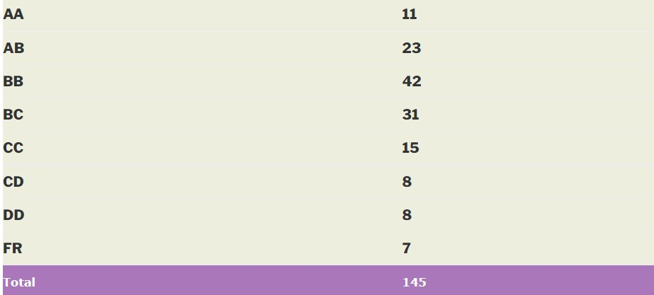

### EE 222 – ELECTRICAL MACHINES AND POWER ELECTRONICS

**Academic Year:** 2014-2015

**Semester:** Spring

**Course Instructor:** Prof. Mukul C. Chandorkar

**Motivation for this course:**

This course is an extension of EE-111 and introduction to power electronics. It gives good insight into applications of power electronics and power systems like lift control etc. One gets to learn various tools such as state space averaging, PWM etc which are very useful in general.

**Prerequisite:** None as instructor started out with basics however EE-111 knowledge would be useful.

**Course Content:**

* Induction motor- structure, working and equivalent circuit modelling
* AC drives- working and control concepts of PWM and space vector modulation
* DC to DC converters – buck, boost and flyback convertor
* State space modelling

**Lectures:**

Lectures were pretty easy to follow and explained really well. Way of teaching was blackboard based and sometimes aid of simulation was taken to make lectures interesting. Instructor was keen in generating interest among the students.

**Assignments and Tutorials:**

No tutorials and assignments as such, however problems and previous exam papers were uploaded before the exams.

**Exams:**

2 objective quizzes – total 20% + Midsem (30%) + Endsem(50%)

**Difficulty:** 7 on scale of 10

**Grading:**

Grading was neither too chill nor very strict

Reviewed by - **Dheeraj Kotagiri** <kdhiru1994@gmail.com>