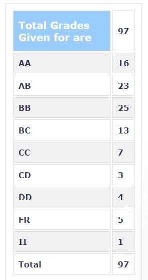

**Review by**  
Ishan Phansalkar, 2024(IDDDP CMInDS)

**Course Offered In**  
Autumn 2022

**Instructors**  
Prof. Kushal Tukley

**Prerequisites**  
EE301: EM Waves

**Difficulty**  
Moderate

**Course Content**  
Starts with a recap of EE301 with transfer lines and EM waves. The focus is quickly changed to the basic monopole and dipole antennas which is mostly formula based with little to no derivations. Some other antennas will also be explained with brief explanations. The second half is entirely focused on different types of more complex antennas, like microchip arrays, helical antennas etc., again a brief explanation is given and the majority of the focus is on which formulas to use where.

**Feedback on Lectures**  
Slightly haphazard, mainly going through the formulas mentioned with some intuitive theoretical explanations. 

**Feedback on Evaluations**  
The grading policy followed for the Autumn '21 offering of the course was:
- Quizzes     : 10% (best of 2)
- Term Paper and Presentation : 25%
- Midsem      : 25%
- Endsem      : 40%

The exams had fairly straightforward questions, require you to have paid attention in class or have gone through the provided previous assignment solutions in order to answer.

The term paper can be submitted by a group a 2-4 students, you'll be required to slect a topic from the form floated. Graded generously.

**Study Material and References**  
The slides are slightly cluttered and mostly contain just formulas. The reference book recommended is moderately helpful. 

**Final Takeaways**  
Introduces you to a wide range of antennas with their particular use cases. 

**Grading Statistics:**  

