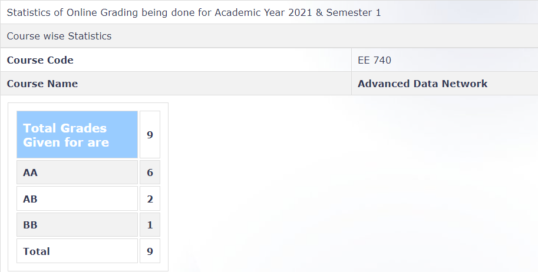

**Review by**

Anupam Nayak (DD CSP 2024)

**Course Offered In**

Autumn 2021-22

**Instructors**

Prof. Prasanna Chaporkar

**Prerequisites**

- EE 325 (Probability and Random Processes) 
- EE 621 (Markov Chains and Queuing Systems) (soft prerequisite)
- EE 706 (Communication Networks) (soft prerequisite)
- Background in Game Theory might be helpful 

**Difficulty**

3/5

**Course Content**

Since the class size was small the instructor regularly consulted the students to decide what topic to teach next based on their interests. The following topic were covered in the 2021 offering:
- Review of Discrete time Markov Chains and common Queuing Models
- Foster Lyapunov conditions
- Scheduling policies for Constrained Queuing Networks
- Applications of Markov Chain Monte Carlo (MCMC) 
- Introduction to Game Theoretical modelling of Multi agent networks

**Feedback on Lectures**

The lectures were interactive and almost all the students were involved in classroom discussions due to the small class size. The lectures were moderatly paced although the were a bit slow during the beginning.
The instructor taught everything by writing it on his ipad as a result of which we did not have to make notes(online mode, prof shared the pdf after the lecture). Taking notes would be strongly recommended in offline mode if the prof ends up using the blackboard. Try not to miss any of the lectures, as many times there is no particular resource from which the Professor taught the course. 

**Feedback on Evaluations**

Evaluation was based on take home and in person quizzes (5x10%) midsem(10%) and Course project(40%). The exams were open book and doable provided one understands everything taught in class. The exams often involved a single question (Proof/design a policy) that tested all the concepts taught in the class.

**Study Material and References**

Different parts of the course are taught from multiple sources. The instructor provided reference material everytime he used one although class notes were sufficient for most sections.

**Follow-up Courses**

Topics course can be always followed up by RnD in the same field

**Grading Statistics:**

