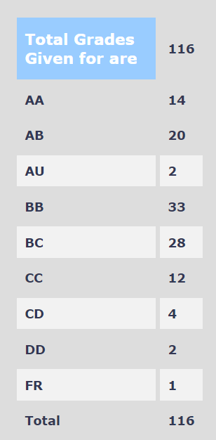

### EE 602 – Radar Systems

**Course offered in:**
Session – 2019 Spring
**Instructors:**
Prof. Kushal Tuckley

**Course Content:**

1. Introduction to Radar
2. Understanding Radar Design parameters: The Radar Equation, Receiver Sensitivity, Signal to Noise Ratio, Noise Figure
3. Continuous Wave Radars: Linear FMCW Radars, Applications of FMCW Radars
4. Transmitters, Duplexers and Circulators
5. Antennas used in Radar Systems: Array Antennas, Beam steering
6. Receivers
7. Radar Target Tracking
8. Navigational and Strategic applications of Radars

**Prerequisites:**
The course is easy to follow if one has done EE 302 (Electromagnetic Waves) and EE 204 (Analog Systems). These are not hard prerequisites though.

**Feedback on Lectures:**
The Prof. has a very good knowledge about the course. He is very enthusiastic about the lectures. There are no presentation slides for the lectures. Everything is explained on the board. The Prof. though is very lenient in handling the class ambience, as a result of which except for the first 2-3 rows no-one listens during the lectures. If you are targeting an AA or AP grade and do not want to burn the midnight oil during the exams, I’d suggest that you be attentive and keep taking notes during the lectures. These will turn out to be pretty handy.

Feedback on Assignments/Tutorials/Exams:

There were 2 quizzes and 1 presentation (best 2 of the 3 were taken), one Mid-Semester exam and an End-Semester exam. The presentation required understanding one of the research papers uploaded by the prof and explaining it using a PPT and also providing applications. The exams were pretty easy, although Prof. ensured adding one difficult question which were only followed by those who attended the classes regularly. There were lecture notes prepared which were sufficient enough for all the exams.

**Difficulty:**
2

**Grading Statistics:**

**Study Material and References:**
There were no books that were followed, and the lecture notes provided by the Prof. were more than sufficient.

Review by - Nimit Kapadia