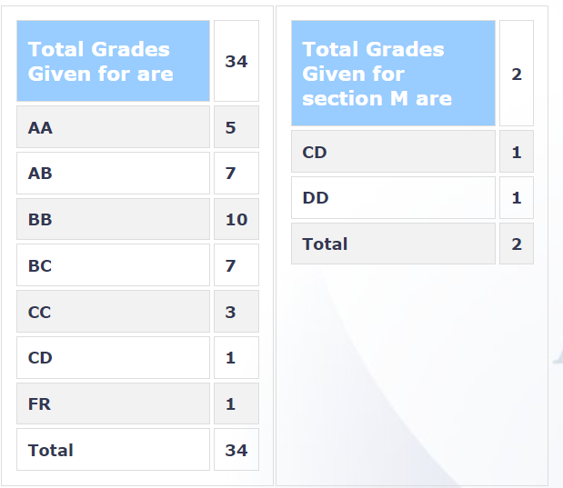

### EE605 - Error Correcting Codes

**Course offered in:**
Session – Autumn 2021
**Instructors:**
Prof. Nikhil Karamchandani

**Course Content:**
Notion of error correcting codes, minimum distance, and rate, error detection / correction capability, basic treatment of algebraic structures like groups / finite fields,linear block codes and their general properties, popular example constructions such as Hamming, Reed Muller, Reed Solomon codes, Cyclic and Convolution codes. The course also discussed expander codes, group testing, disjunct and separable matrices, and concatenated codes.

**Prerequisites:**
A strong background in Linear Algebra and Probability Theory is essential.

**Feedback on Lectures:**
The lectures were straightforward and to-the-point. Most of the lectures were quite mathematical, and structured in such a way that the professor either discusses a new concept, or introduces one or two important results before proceeding to outline their proofs. The course content itself is quite interesting, and the professor does an excellent job of explaining even the more confusing results. Following the lectures should get you through most of the tutorials and exams without any difficulty.

**Feedback on Tutorials, Assignments and Exams:**
There were two homeworks given, worth 10% each, which accounted for a total of 20% of the total evaluation. The homeworks were quite straightforward and mostly just relied on the definitions discussed in class, and asked you to prove some simple results. Moreover, ample time was given for each homework, so scoring well was quite easy.

There were also 3 quizzes conducted with the best 2 being considered for a total of 20%. The quizzes were similar to the homework and were towards the easier end. The grading was also fairly reasonable.

The midsem examination, which accounted for 30% of the total weightage, was towards the tougher end with loads of new problems to think about. However, the grading was quite lenient with ample marks given for a decent effort.

There was no endsem examination, but rather an endsem project. The endsem project was done in pairs, and accounted for 30% of the grade. The project involved picking up a research paper in the field and conducting a systematic review of the paper and proving any results the paper mentioned. We were to then present the paper to our peers via a short video. We were also expected to have a look at presentations of other groups, and to ask questions from their presentations. Following this, each group had to try its best to come up with an answer for the questions that other groups had asked regarding their presentation. In my opinion, this back-and-forth exercise for highly beneficial since it not only made you thorough with your own research topic but also gave you a glimpse into what other groups had worked on. Of course, the lack of an endsem also made the course much lighter as a whole.

**Grading Statistics:**

**Difficulty:**
2/5

**Study Material and References:**
The professor mainly followed Error Control Coding by S. Lin and D.J. Costello, and Introduction to Coding Theory by Roth. However, loads of other references were also mentioned in case students required them.

Review by - Ishan Kapnadak, 2023 (BTech)