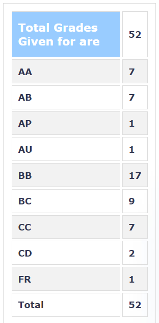

### EE 606 – FIBRE OPTIC COMMUNICATION

**Course offered in:**
Session – 2019 Spring
**Instructors:**
Prof. Joseph John

**Course Content:**
1. Introduction to fibre optic communication
2. Optical Fibres: Ray Theory and Mode Theory, Fibre fabrication, Fibre Attenuation: Absoption losses, Scattering losses, Bending losses; Dispersion: Intramodal Dispersion, Intermodal Dispersion, Polarization Mode Dispersion
3. Optical sources
4. Photo-detectors
5. LED and Laser Diode Transmitters: Design considerations
6. Fibre Optic receivers: receiver noise, receiver configurations
7. Digital Link design
8. Wavelength Division Multiplexing
9. Optical Amplifiers
10. Optical Networks
11. Non-linear Effects
12. Coherent Optical Communication
13. New FO systems: POF, Long haul and very high data rate systems

**Feedback on Lectures:**
Prof. Joseph John is an excellent teacher. He explains the topic really well and makes sure that every student understands it. He is also enthusiastic to bring samples of optical fibres from his lab to help make the students visualize what they are studying. His lectures generally include most of the important stuff which is highly likely to appear in the exams. Hence taking down notes during the lectures will surely help during the exam preparations. The PPT slides are very self explanatory. But these presentations are never uploaded. One is therefore expected to take down notes. Instead of presentations, professor will upload relevant pages of the book for each class. These pages are must read before exams. These pages contain a lot of information some of which may not have even been taught by the prof. Therefore it’s necessary to take down notes during the lecture.

**Feedback on Tutorials, Assignments and Exams:**
Mid sem exam : 35 %
End sem exam (3 hours) : 50 %
Quizzes: 2 : 15 %
Daily (non-graded) tests (10 minutes)

Exams are only based on what the Prof. has explained during the lectures. Hence, if you are regular at keeping notes, you are sure to get an AA or AP grade. The difficulty level of exams is slightly on the lower side.

**Grading Statistics:**

**Difficulty:**
3/5

**Study Material and References:**
1. Gerd Keiser, Optical Fiber Communications, 4th edition/5th edition, Tata McGraw-Hill, India, 2008/2012 2. Papers from Journal of Lightwave Technology (IEEE) and other journals.

Reviewed by Nimit Kapadia