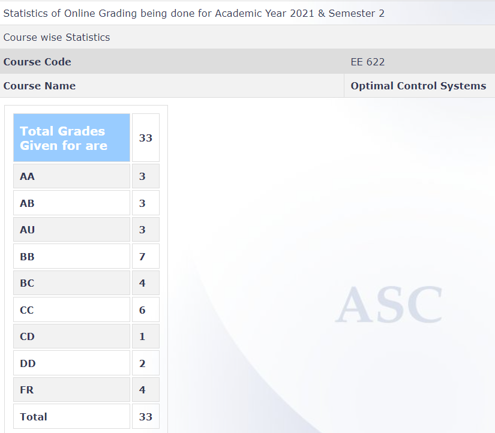

---
layout: page
title: EE 622 – Optimal Control (2021)
cover-img: assets/img/Cover_study.jpg
thumbnail-img: ""
share-img: ""
comments: true
tags: [Elective, Control]
---

**Review by**
 
Rohan Jasani, 2022(B.Tech EE)

**Course Offered In**
Spring 2021 (2021-22)

**Instructors** 
Harish K. Pillai

**Prerequisites:**
None. 
No hard prerequisites. Basic optimisation course would be helpful in early part of course but useless for 90% of course. Basic control system course would be great to understand the application of this course otherwise it will turn into a parameter optimization course.

**Difficulty:** 
3.67/5
In terms of understanding the concepts and proofs-4/5.

In terms of problem solving-3/5.

80% of the exam questions are straightforward if you have solved assignments thoroughly and have gone through the textbooks(mentioned later). Just apply formula and solve. Though time given is pretty low so you have to be fast in solving. But remaining 20% of the questions(only for AA and AP guys) are really difficult and expects out of the box way of solving and/or expects deep understanding of the concepts.

**Course Content**
1. Review of Finite Dimension Optimization
1. Infinite Dimensional Optimization
1. Calculus of Variations
1. Variational approach to Optimal Control
1. Maximum Principle
1. Optimal Control via MaximumPrinciple
1. Bang Bang Principle for linear systems
1. Dynamic Programming
1. HJB Equations
1. Linear Quadratic Regulator and Ricaati Eqns

**Feedback on Lectures**
Early part of the course is just a review of basic optimisation techniques. From Calculus of Variations the lectures were in line to line with “Calculus of Variations and Optimal Control Theory: A Concise Introduction” by Daniel Liberzon. Recording of lectures were made available on moodle. Lectures are not sufficient to solve the assignments and Exams. Going through “Optimal Control Theory: An Introduction” by Donald E. Kirk is a necessity, as in lectures only most basic cases would be discussed which are not enough for exams and assignments.

**Feedback on Evaluations**
Marking/Paper-Checking was lenient. Grading:

**Study Material and References**
1. Calculus of Variations and Optimal Control Theory: A Concise Introduction by Daniel Liberzon
1. Optimal Control Theory: An Introduction by Donald E. Kirk

Book by daniel liberzon is easy to read with detailed reasoning but only covers basics. Book by Kirk is concise and covers all possible cases but hard to follow. Hence going through both the books is necessary.

**Follow-up Courses**
This is a pretty basic course in the world of functionals. Techniques/concepts learnt in this course opens up the door to some advanced courses in maths, physics and control systems.

**Final Takeaways**
Different techniques to maximize/minimize a functional.

**Grading Statistics:**
