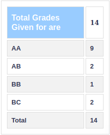

**Review by**

Millen Kanabar, 2023 (DD)

**Course Offered In**

Autumn 2021

**Instructors**

Debasattam Pal

**Prerequisites**

Basic math (MA 1xx) courses, probability (EE 325)

**Difficulty**

Easy-Moderate

**Course Content**

 As the title says, the course has two components- estimation and
 identification. The identification. Identification was only briefly
 touched upon; the course\'s main focus was estimation. The instructor
 asked for student feedback and structured the course according to the
 consensus of the class.

1.  Estimation of a deterministic parameter

    a.  Estimation of a scalar parameter

        i.  Cramer-Rao Lower Bound (CRLB) and Fisher information

        ii. Estimation of a function of a scalar parameter

    b.  Estimation of a vector parameter

        i.  Extension of the CRLB and Fisher information

        ii. Estimation of a function of a vector parameter

    c.  Minimum variance estimator

        i.  Linear models

        ii. Sufficient statistics, Rao-Blackwell-Schaffe theorem

    d.  Best Linear Unbiased Estimator (BLUE)

    e.  Maximum Likelihood Estimation (MLE)

2.  Estimation of a Stochastic Parameter

    a.  Bayes' theorem

    b.  Minimum Mean Squared Error (MMSE) Estimator

    c.  Linear Minimum Mean Squared Error (LMMSE) Estimator

    d.  Weiner filtering

    e.  Kalman Filter

        i.  State space representation

        ii. Prediction and Innovation

**Feedback on Lectures**
 The professor was very involved in lectures and took time and effort
 to ensure that the content got through to students. Doubts were
 promptly answered, and students were encouraged to discuss and answer
 throughout class.

**Feedback on Evaluations**

 Evaluation was conducted through quizzes, a midsem, an endsem, and a
 project. The papers were not lengthy/difficult, and the project was
 easy to implement. Solving tutorials served as sufficient practice for
 exam preparation.

**Study Material and References**

 1\. Steven M. Kay. Fundamentals of Statistical Signal Processing:
 Estimation Theory.

 Prentice Hall, Upper Saddle River, New Jersey, 1993.

 2\. Tohru Katayama. Subspace Methods for System Identification.
 Springer-Verlag, London, 2005.

**Follow-up Courses**

-

**Final Takeaways**

 The course was well-structured, and lectures were easy to follow; the
 instructor cared not to leave anyone behind. The content is sometimes
 mathematical, and a little abstract, but the tutorials and evaluations
 help clarify ideas.
 
 **Grading Statistics:**

