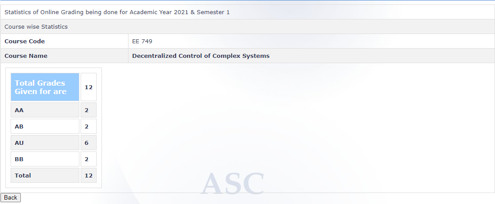

**Review by :**

Dhruv Shah, 2023(Btech)

**Course Offered In :**

Autumn 2021-22

**Instructors :**

Prof. Debraj Chakraborty

**Prerequisites :**

E302 or EE640 or an equivalent course in basic control theory

**Difficulty :**

4/5
The course content is difficult  and will require consistent efforts to do well

**Course Content :**

1.  Graphs and Matrices:
	a. Properties of the Laplacian matrix
	b. Graph connectivity
	c. Non-negative matrices
	d. Perron Frobenius Theory

2.  Cooperative Control of Multi-agent systems:
	a. Coordination, Consensus algorithms
	b. Formation Control, Flocking.
	c. Connectivity Preserving distributed control
	d. H-2/H-infty performance of Consensus Protocols

**Feedback on Lectures :**

The instructor teaches enthusiastically and is very concerned about students’ understanding. The lecture notes are available on the course webpage but it is highly recommended that one attends all the lectures because it becomes progressively difficult to understand just by reading the notes.

**Feedback on Evaluations :**

Assignments: 20%
Midsem: 30%
Endsem: 40%
Project: 10%
Assignments were released after completion of some topics in the class. There were 4 assignments all of which were tough and lengthy but very fun to solve. The midsem was slightly tougher than the endsem and both had problems that were inspired from the assignments or classroom discussions.
Students were asked to submit the links of research papers which they were interested to implement as a project. After the instructor’s approval, the students had to implement the paper and submit a report. The project was graded leniently.

**Study Material and References :**

1. R. B. Bapat, Graphs and Matrices, TRIM Series, Hindustan Book Agency, 2011
2. Bapat and Raghavan, Non-Negative Matrices,  Cambridge University Press, 1997
3. Carl D Meyer, Matrix Analysis and Applied Linear Algebra, SIAM, 2001
4. Wei Ren, Randal W. Beard, Distributed Consensus in Multi-vehicle Cooperative Control, Communications and Control Engineering Series, Springer-Verlag, London, 2008
5. Jeff S. Shamma Editor, Cooperative Control of Distributed Multi-Agent Systems, John Wiley and Sons, West Sussex, England, 2007.
6.Frank Lewis, H. Zhang, K. Hengster-Movric, A. Das, Cooperative Control of Multi-Agent Systems: Optimal and Adaptive Design Approaches, Springer-verlag, London 2014
7. Z. Li and Z. Duan, Cooperative Control of Multi-Agent Systems: A Consensus Region Approach, CRC Press, 2015.

**Follow-up Courses :**

None

**Final Takeaways :**

This course is also usually known as “Multi Agent Systems”. It deals with designing control laws for large scale interconnected systems for example a fleet of drones. The goal is to make the entire system satisfy a collective control objective and this is achieved in a distributed manner where one uses the interconnectedness of the system to their advantage and design computationally cheaper control laws. This has applications in distributed optimization, power systems, swarm robotics etc. One can start contributing to research in this field after this course.

**Grading Statistics :**

