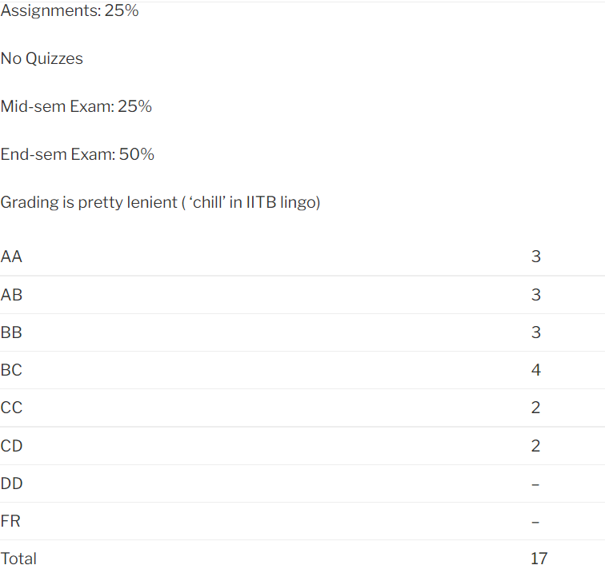

### EE 432 – SPECIAL SEMICONDUCTOR DEVICES

**Course offered in:**

Autumn 2014

**Instructors:**

Prof. Dipankar Saha – Excellent Prof for the course.

**Note:** The course was initially named **‘EE 432: Special Semiconductor Devices’.** Also, this course is a (partial) merger of **‘EE 457: Compound Semiconductor Materials** and Devices’ and **Special Semiconductor devices’**

**Motivation:**

As the name suggests, this course focuses majorly on optoelectronic devices. The final goal is to understand the fascinating and futuristic applications of these devices.

**Prerequisite:**

EE 112:  Introduction to electronics; EE 207: Electronic devices and circuits

**Course Content:**

The course builds from the scratch i.e. bulk semiconductor physics and takes you to the applications of devices like LEDs, LASER etc.

This is the brief outline of course content :

- **Review of bulk semiconductor physics : crystals, compound semiconductors, bandstructure, density of states, doping and carrier concentration, Fermi statistics**
- **Optical properties of semiconductors:** direct and indirect optical absorption, excitons, free carrier absorption, refraction, Kramers-Kronig relation, spontaneous and stimulated emission, Einstein coefficients.
- **Electronic transport in semiconductors:**

- **PN junction:** band diagram, thermal equilibrium, electrostatics and Poisson’s equation, depletion approximation, forward and reverse biased diodes, breakdown, tunneling, impact ionization, p-i-n diodes

- **Heterostructures:** lattice constants and bandgaps, band offsets and heterostructure types, quantum wells, optical properties of Quantum structures, Schottky diode, heterojunction diodes, role of interfaces, current transport, photoconductors, Photodiodes, Light Emitting Diodes and LASERs.

**Difficulty Level:**

Easy to moderate.

**Feedback on Lectures:**

Lectures are the best way to learn this course. Great interaction- doubt clearing, intellectual discussion during and after the class (if you are genuinely interested) but this is professor-specific. Content is a bit repetitive in the beginning but takes an informative and mind-tingling track later. Classes were a bit irregular at times. It’s especially good for people interested in electronic device physics and applications. There was no textbook as such and no slides either (proper black-board teaching) but references were provided.

**Feedback on assignments, tutorials and exams:**

There was just one assignment (was supposed to be few more).Questions are a bit thought-provoking but the professor was all in to help/discuss them in the class or later. The quizzes were based on the lectures and assignment questions. The mid-term and end-term exam papers were not very challenging but tested your concepts.

**Grading Statistics:**

**Advanced courses that can be taken after this course:**

A basic level of research can be started on optoelectronic and compound semiconductor devices after doing this course.

Review by – Md. Tahir Patel (mdtahirpatel.92@gmail.com)
