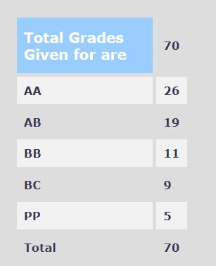

**Review by**

Shailee Suryawanshi

**Course Offered In**

Spring 2020

**Instructors**

Prof. Girish Kumar

**Prerequisites**

No prerequisties but a good knowledge of EM Waves (EE301) and PH108 would be great.

**Difficulty**

2/5

**Course Content**

1. Transmission Lines
2. Smith Chart and Impedance Matching
3. ABCD and S parameters for the transmission lines
4. Power Dividers and Combiners
5. Microwave Couplers, Filters, Diodes, Transistors, Attenuators
6. RF Switches
7. Phase Shifters
8. Microwave Amplifiers
9. Effect of Microwave on Human Body
10. Low Noise Amplifiers
11. Power Amplifiers
12. Microwave Mixers, Oscillators, and Systems
 
**Feedback on Lectures**

The professor used to teach via his recorded lectures on NPTEL. He didn’t teach via slides or board. Even though the lectures were available on the NPTEL, the attendance was kept mandatory and for <75% he said to award a DX grade. The lectures were quite easy to follow. The only problem was asking doubts as the professor used to take all the doubts at the end of the video so interactive doubt clearing was not possible.

**Feedback on Evaluations**

The professor conducted the regular tutorial sessions. These sessions were very helpful as you can easily get your doubts cleared during these sessions. The questions asked in the exams were similar to or indirectly related to the tutorials. The professor conducted one quiz and midsem(rest was not done due to COVID). The midsem was moderately difficult and the quiz was easy. 

**Study Material and References**

1. D.M. Pozar, Microwave Engineering, John Wiley & Sons, 2012.
2. K.C. Gupta, et. al., CAD of Microwave Circuits, Artech House, 1981.
3. B. Bhat and S.K. Koul, Stripline Like Transmission Structures, John Wiley & Sons, 1989.
4. R.E. Collin, Foundation of Microwave Engineering, McGraw Hill, 2001.
5. S.Y. Liao, Microwave Circuit Analysis and Amplifier Design, Prentice Hall, 1987.
6. I. J. Bahl and P. Bhartia, Microwave Solid State Circuit Design, John Wiley & Sons, 2003
7. G. D. Vendelin, A. M. Pavio, and U. L. Rohde, Microwave Circuit Design using Linear and Nonlinear Techniques, John Wiley & Sons, 2005.
8. Stephen A. Maas, Microwave Mixers, Artech House, 1986
9. J. D. Kraus, Ronald J. Marhefka, Ahmad Khan, Antennas and Wave Propogation, 4th Edition, Tata McGraw Hill, 2017
10. Constantine A. Balanis, Antenna Theory: Analysis and Design, Wiley, 4th Edition, 2016
11. G. Kumar and K.P. Ray, Broadband Microstrip Antennas, Artech House, 2003

Although none of these were strictly followed.

**Final Takeaways**

**Grading Statistics:**

