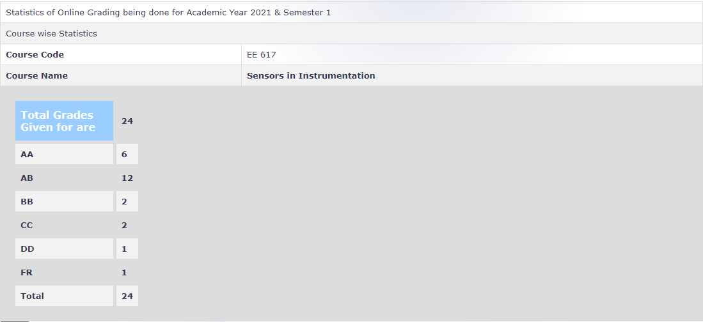

---
layout: page
title: EE 617 - Sensors in Instrumentation (2021)
cover-img: ""
thumbnail-img: ""
share-img: ""
comments: true
tags: [Elective, Devices]
---

**Review by:**

Shlok Vaibhav Singh, 2023(DD)

**Course Offered In :**

Autumn 2021-22

**Instructors :**
Prof. Siddharth Tallur

**Prerequisites :**

None specifically, but knowledge of second-year EE courses is recommended

**Difficulty :**

Medium

**Course Content :**
Note to DAMP BLOG: It is recommended that a flair be put that this review is based on online offering with no lab component and can significantly differ from all future offerings

As the name says, this course is about sensors and instrumentation. The course starts with a formal introduction to what exactly sensors are and what exactly measurement is. Next, the course teaches how to understand various metrics in datasheets like typical specifications, noise figures at various temperatures, etc and concepts like Allan variance, Diamond plots, ENOB, etc. Noise sources and their detailed analysis with examples is discussed. 

The latter part of the course focuses on applications like Lock-in Amplifier, synchronous demodulation, and topologies like Auto-Zero Amplifier, Chopper Amplifier, etc.

A big component of learning is course project where one can pick any particular application/type of sensor and do a literature review of atleast 10 papers on that topic. A report of 4-5 pages in IEEE format and a recorded presentation have to be submitted. Prof. Tallur was always eager to guide us by directing our survey strategy. A small component of evaluation requires one to perform own analysis or simulation based on the literature review as well.

**Feedback on Lectures :**

The lectures are comprehensive, and professor explained all concepts and doubts very patiently. Along with lectures, some videos and reading materials were shared and were very interesting. 

**Feedback on Evaluations :**

Being online sem, the lab component for the 2021-22 offering was scrapped. The evaluation was based on 3 components: a midsem viva (20%), an endsem viva (20%) and the course project (60%) but in an offline sem, this can be very different. Grading is very lenient:

**Study Material and References :**

Prof. Tallur did not follow any specific book, he prepared the content by himself and provided videos and short papers from various instrumentation companies regularly to supplement the understanding, which made the entire course very discussion oriented. 
The Measurement, Instrumentation, and Sensors handbook by John Webster was mentioned in course and can be useful for those looking to read about sensors in detail 

**Follow-up Courses :**

After this, you will have good idea about reading datasheets, noise analysis of opamps  and your own circuits etc, so this will greatly help in any lab which is taken. For theory courses, EE625 Biosensor and BioMEMS and EE701 Introduction to MEMS can be taken next.

**Final Takeaways :**

This course is highly recommended if you are planning to work in analog design or on any project that involves sensors and measurement.

**Grading Statistics :**

