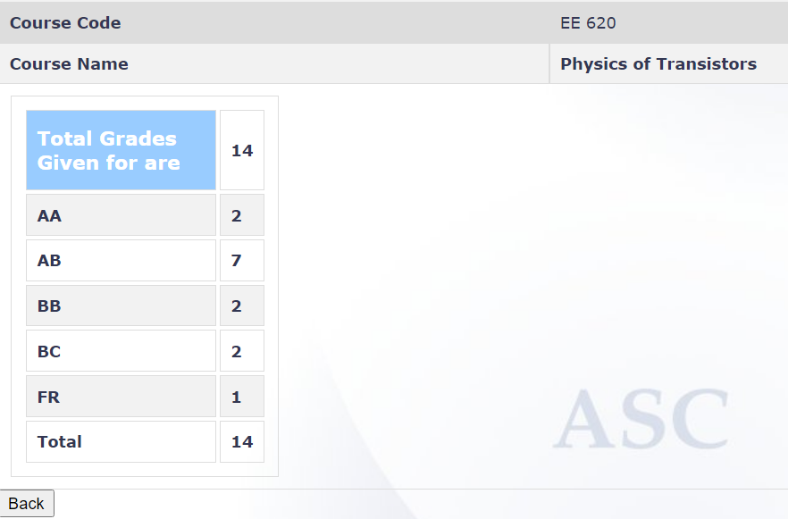

**Review by**

Jay Sonawane, 2024(BTech+MTech Dual Degree)

**Course Offered In**

Spring 2022

**Instructors**

Prof. Souvik Mahapatra and Prof Sandip Mondal

**Prerequisites**

EE207- semiconductor fundamentals, MOSFET fundamentals covered in EE207. Coding in python/ MATLAB.

**Difficulty**

4/5 

**Course Content**
According to the course guidelines the content that is supposed to be covered is:
1) MOS Capacitor (5 weeks)
2) MOSFET (4 weeks)
3) MOSFET scaling and short channel effects (2 weeks)
4) Advanced scaling concepts (if time permits)

 
**Feedback on Lectures**

The lectures (taken by Prof. Souvik Mahapatra) are good and the instructor puts in good efforts for the understanding of students. The instructor doesn’t engage in explaining proofs rigorously. There are concert questions in between lecture slides that help in grasping the concepts better as the course proceeds. Regular tutorial sessions (taken by Prof. Sandip Mondal) are conducted in the lecture slot itself. In the spring 2022 offering, these sessions were not useful for the assignments for which they were meant to. In the spring 2021 offering, tutorial sessions conducted were helpful for the assignments and can be referred to.

**Feedback on Evaluations**

There are no exams in this course. A set of assignments (>10) are expected to be submitted. There was also a simulation-based assignment on sentaurus TCAD. Apart from assignments, there are two mini projects. The deadline isn’t hard and students get ample time to complete them. The TAs were not that helpful in the spring 2022 offering. 

**Study Material and References**

Books by Pierret, Taur and Ning, Tsividis, Sze, Nicollian, and Brews
Papers (will be provided)
Students can also refer to the lectures of Mark Lundstrom which cover semiconductor fundamentals and concepts appertaining to MOS. 

**Follow-up Courses**

1) EE788 Advanced CMOS Logic Flash Devices (by the same professors) is an immediate follow-up course. EE788 has EE620 as its prerequisite. 
2) To explore students can take EE723 (offered in the autumn semester) and EE724, and EE727 (offered in the spring semester) in parallel. EE620 is not the prerequisite for these courses. I took EE724 and EE620 in parallel and it helped personally (although there was a little overlap between those courses)
3) EE675 Microelectronics simulation lab consists of TCAD simulation labs.

**Final Takeaways**

This course is the gateway to micro/nanoelectronics and is a must for those who want to explore these fields. It was a core course for Microelectronics specialization earlier which speaks for its gravity. The instructor is bound to change and hence the review is bound to be subjective.

**Grading Statistics:**

