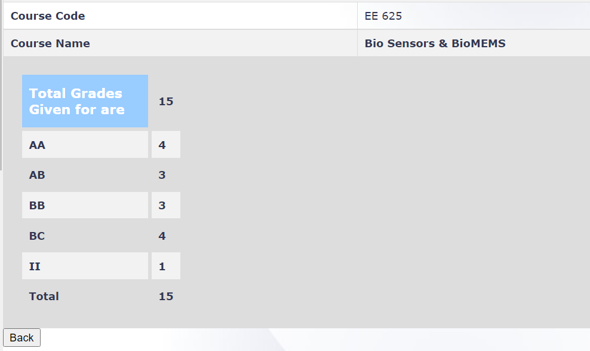

**Review by**

Shaan Shah and Arush Tadikonda, 2023 (BTech)

**Course Offered In**

Spring 2021-2022

**Instructors**

Prof. Pradeep Nair

**Prerequisites**

None

**Difficulty**

3/5 (on a scale of 1-5 with 5 being very tough)

**Course Content**

- Module I: Overview of Sensors, Important Physical Phenomena, System level issues
- Module II: Electronic, Electrochemical and Mechanical Biosensors
- Module III: Multi-analyte sensors
- Module IV: Wearable/Implantable/Epidermal Electronics
- Module V: Massively Parallel Sensors
- Module VI: Future outlook

The course starts with the basics of reaction kinetics and then builds up to analysing biosensors based on a variety of different detection schemes such as reaction-based, electric detection based and MEMS-based sensors.

**Feedback on Lectures**

The lectures were run partly online and partly offline. Professor Nair explains the concepts very well, drawing up relevant analogies. He also made efforts to assist students with no electrical background. Research papers were discussed in the class to explain most topics. The content covered was also practically oriented and also the topics were covered to just the right depth while making sure that the content did not become too "detail-oriented".

**Feedback on Evaluations**

- Assignments 10%
- 2 Quizzes 10%
- Midsem 15%
- Endsem 25%
- Project 40%

Quizzes and Midsems were straightforward with cheatsheet being allowed while endsem required some amount of critical thinking. Projects were given by the prof from various course topics. Assignments can be solved using MATLAB or even by hand.

**Study Material and References**

A lot of content was covered directly from papers which are shared by the professor during the course.

**Final Takeaways**

**Grading Statistics:**

