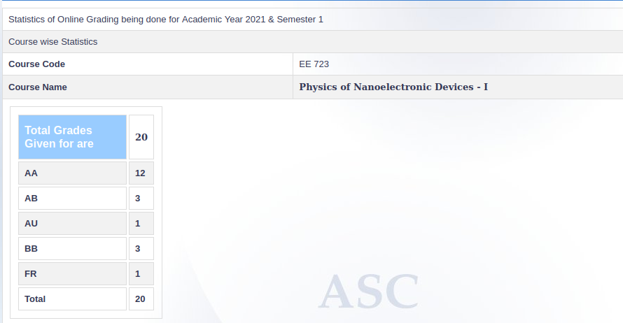

**Review by**
Tanmay Jain, 2024(DD)

**Course Offered In**
Autumn, 2021-22

**Instructors**
Prof. Dipankar Saha

**Prerequisites**
PH 107, but I would say, enthusiasm towards Quantum mechanics and applications should suffice.

**Difficulty**
On scale of 10, would rate it 8.

**Course Content**
If you wanna seriously pursue/ explore Quantum Computation and Quantum Machine Learning, you need a solid foundation of Quantum Mechanics (QM) front. Department of Physics provides two such courses (of 6 credits each): QM - 1 and QM - 2 (Note that QM - 3 exists too). But EE 723, an 8 credits course, starts from basics of PH107 and ends with approximately covering both QM1 and QM2 contents.  This course also becomes a prerequisite for Advanced Device Physics. FYI, IIT Bombay has one of the best Micro-electronics labs in Aisa. This is what Professor had told us. So this might just provide some motivation for taking this course.

Now coming to course content:

You can have a look at this [link](https://www.ee.iitb.ac.in/web/academics/courses/EE723). This is totally how course proceeds, in the same sequence as given there

**Feedback on Lectures**
I had done this course in online semester. Professor used to take lectures on Google Classroom. He used to scribble on his one note app and we had to make notes of live lectures. The lectures were recorded and there was no compulsion of attendance. Professor used to clear each and every doubt in the class. He religiously followed the Liboff textbook whose name and details are mentioned in Study Material and References section. I enjoyed the live lectures, though I had to see recordings few times. I would like to add that the professor is really considerate and understanding.

**Feedback on Evaluations**
We had eight assignments, so approximately one assignment every 10 days. There was no midsem, instead we had to submit two of the eight assgnments on midsem exam day. Most of the questions were from Liboff book, but mind you, there is no solution manual available anywhere on the internet (I can vouch for this ;) !!). Each assignment had 8-10% weightage approximately. Endsem had 20% weightage. There was no project.

About grading, well grading stats speak for themselves. If you maintain consistency in your efforts for assignments, you will surely land up having a good grade.

**Study Material and References**
Professor strictly follows only one book: Richard L. Liboff - Introductory Quantum Mechanics-Addison-Wesley, Pearson Education.

**Follow-up Courses**
EE 724: Nano electronics, EE 727: Physics of Nano-scale Devices II, PH 534: Quantum Computation and Information, PH 523: Quantum Mechanics III

**Final Takeaways**
As I stated earlier, if you wanna study something related to Quamtum Machine Learning/ Quantum Computation, which are research hot topics by the way, you can surely start with EE 723. I loved the content and the assignments as well. Every single time, you need to come out with new ideas on your own and trust me, you will amaze yourself by the end of the course as it has many such ‘wow moments’

**Grading Statistics:**

