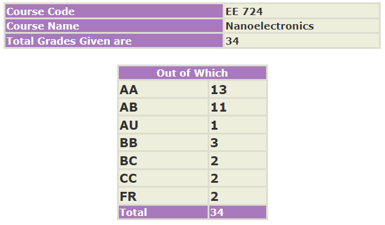

**Review by:**
 
Suraj Sarvesha Samaga, 2023(BTech.)

**Course Offered In:**

Spring 2021

**Instructor(s):**

Prof. Bhaskaran Muralidharan

**Prerequisites:**

Basic Requirements: EE 723, EE 733, EE 207 or equivalently knowledge in Basic Solid State, Basic QM.

While the above are only SOFT prerequisites, it is recommended to do EE 723 before this course to appreciate the content better. However the professor allowed sophomores (myself included) to take the course without fulfilling the course prerequisites as well.

**Difficulty:**

4/5

**Course Content:**

The course content was divided into 4 modules:

##### Module 1: Key concepts of nano-devices:
1. Understanding current flow, Quantized conductance, Elastic resistor model, ballistic transport basics
2. Bottom up view point, Landauer approach, connection with diffusive transport
3. Role of electrostatics, case of nano transistor, drift-diffusion, Boltzmann transport formalism

##### Module 2: Nanoelectronic Devices
1. Schrodinger equation, Hamiltonian, Density of states
2. Concept of band structure, applications to quantum wells, nanowires, carbon nanotubes, graphene
3. Non-Equilibrium Transport – Green’s Functions, Self-Energy, NEGF formalism and applications to molecular electronics, resonant tunnelling diodes

##### Module 3: Spintronic Memory Technology:
1. Concept of spinors and vectors, spintronic devices
2. Magnetoresistance phenomena, modelling MTJ devices
3. Spin transfer torque, Spintronic device modelling

##### Module 4: Si-based Quantum information and computing:
1. Single spin Si based quantum computing and quantum information
2. Coulomb Blockade, Law of Equilibrium, Thermodynamics of Nanodevices

Module 1 and about 50% of Module 2 were covered pre-midsem. Modules 3 and 4 were covered in brief, whereas the treatment in Modules 1 and 2 was more rigorous.

**Feedback on Lectures:**

The professor’s explanations were very crisp and precise, and he did not shy away from explaining the same thing multiple times. However due to the sheer amount of content being covered in the course, each lecture was very heavy.

The course was conducted in an online mode, so lecture slides were used for presentation, and the professor pulled out the whiteboard to explain or emphasize on any important concept or derivation.

**Feedback on Evaluations:**

The evaluation scheme was as follows:
- 3 Assignments – 35%
- Attendance and class participation – 5%
- Mid-semester exam – 25%
- End-semester exam – 35 %

The assignments were a mix of theoretical questions and MATLAB simulations of nanodevices. Most of the outline for the code could be found in the reference book, hence we were required to explain our code in a proper fashion. Sufficient time (2 weeks on average) was given to complete each assignment.

The professor announced a list of important topics right before midsem and endsem. The exams were very conceptual in nature, and while cheat sheets were allowed, a proper understanding of the course content is required to do well.

**Study Material and References:**

References:
1. Supriyo Datta, Lessons in nanoelectronics: A new perspective on Transport, World Scientific (2012)
2. Supriyo Datta, Quantum transport: Atom to Transistor: Cambridge Univ Press (2005) [most useful]
3. T. Heikkila, Physics of Nanoelectronics, Oxford University Press, (2013)
4. Resources from http://www.nanohub.org as instructed

Slides were packed with a lot of information, and the professor would share the slides and relevant chapters from each book after each lecture and occasionally some device-based research papers for further reading. Going through the shared material is advisable for a better understanding of each lecture.

**Follow-up Courses:**

This would provide a good background for quantum computing courses.

**Final Takeaways:**

Having basic knowledge/liking of Quantum Mechanics would be very helpful, especially if you are walking into the course without having done any of the prerequisites. Potentially useful for Quantum Computing/Nanodevices based research

**Grading Statistics:**

