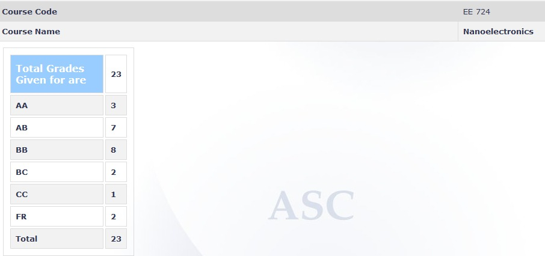

**Review by**

Parin Senta, 2023 (B.Tech)

**Course Offered In**

 Spring 2021-2022

**Instructors**

Prof. Udayan Ganguly

**Prerequisites**

No hard pre-requisites. However, knowledge of EE207 and PH107 helps. Also, basic knowledge of MATLAB is required.

**Difficulty**

3/5 (on a scale of 1-5 with 5 being very tough)

**Course Content**

The course was divided into 4 modules, each taking about a month to complete.

Module 1: 
a. Why do electrons move?
b. Overview of electrostatics
c. Analysing FinFETs: solving Laplacian to obtain device characteristics
d. Effect of Length Scaling on device physics
e. PDE Tool Simulations
    
Module 2: 
a. How do electrons move?
b. Analysis of Band Diagrams
c. Analysis of P-N devices

Module 3: 
a. Quantum to Semi-Classical Picture of Electron
b. Analysis of Energy Diagram of free electron, electron in a crystal.
c. Obtaining physical quantities like force on electron, position, velocity, and effective mass of electron from E-k diagram.
d. Scattering of electrons, phonons.
    
Module 4: 
a. Carrier Transport
b. Concept of Quasi-Fermi Level
c. Developing a general strategy to derive I-V Characteristics of any device(Eg PN, PIN, PNP etc)
d. Space Charge Limited Current (SCLC)

**Feedback on Lectures**

The lectures were interactive. Almost everyone had to participate in class discussions. The professor would teach a new concept and have the class work on a problem related to the concept in class. The slides are not self-sufficient. Also, most of the questions in quizzes were based on the topics discussed in class. Hence, attending lectures regularly is recommended.

**Feedback on Evaluations**

1. 4 Quizzes (one on each module):- 60% (15% each)
2. Assignments (about 4-5):- 15%
3. Course Project:- 20%
4. Class Participation:- 5%
5. No Endsem, No Midsem
6. Relative Grading

**Study Material and References**

1.Fundamental of Modern VLSI Devices: Y. Taur and T. Ning  
2.Introduction to Solid State Physics: Charles Kittel 
3.Fundamentals of Carrier Transport: Mark Lundstorm

**Grading Statistics:**

